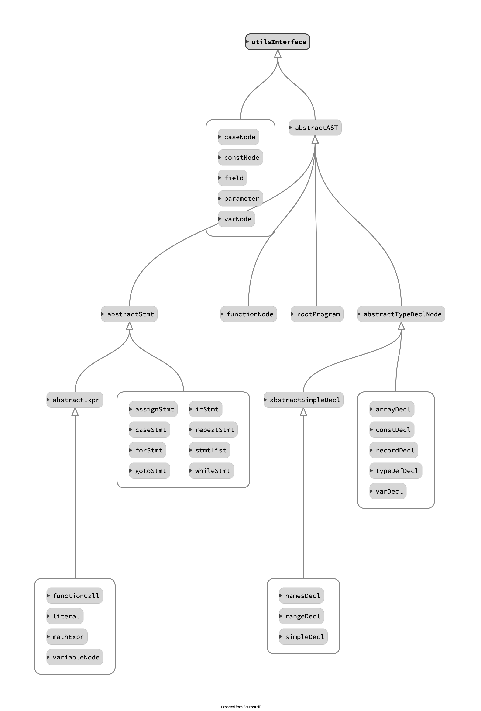

<div>
  <h3 style="text-align:center;margin-top:2em;">编译原理实验报告</h3>
  <div style="display:flex;
              justify-content:center;
              flex-direction:row;
              margin-top:2em;
              margin-bottom:2em;">
    <div>
    	<p style="margin:2em;"><b>作业名称：</b></p>
      <p style="margin:2em;"><b>姓&nbsp;&nbsp;&nbsp;&nbsp;&nbsp;&nbsp;&nbsp;&nbsp;名：</b></p>
      <p style="margin:2em;"><b>学&nbsp;&nbsp;&nbsp;&nbsp;&nbsp;&nbsp;&nbsp;&nbsp;号：</b></p>
      <p style="margin:2em;"><b>学&nbsp;&nbsp;&nbsp;&nbsp;&nbsp;&nbsp;&nbsp;&nbsp;院：</b></p>
      <p style="margin:2em;"><b>&nbsp;&nbsp;&nbsp;&nbsp;&nbsp;&nbsp;&nbsp;&nbsp;&nbsp;系：</b></p>
      <p style="margin:2em;"><b>指导老师：</b></p>
    </div>
    <div style="text-align:center; margin-left:2em;">
      <p style="border-bottom: 1px solid; margin:2em;">spl编译器</p>
      <p style="border-bottom: 1px solid; margin:2em;">薛伟 刘泽铖 徐润森</p>
      <p style="border-bottom: 1px solid;margin:2em;">3180105355</p>
      <p style="border-bottom: 1px solid;margin:2em;">计算机科学与技术学院</p>
      <p style="border-bottom: 1px solid;margin:2em;">计算机科学与技术</p>
      <p style="border-bottom: 1px solid;margin:2em;">王强</p>
    </div>
  </div>
</div>
<div style="text-align:center; margin-top:10em;">2021 年 06 月 20 日</div>

[toc]

### 序言

#### 概述

设计并实现一个SPL-语言（或者类C）的编译系统（SPL-语法见SPL Specs Vxx.doc），掌握编译原理的各个环节：词法分析、语法分析、语义分析、代码生成，以及实现所需的数据结构：语法树、符号表等。通过这样的实验，提高学生协作编程的能力，加深对编译技术的理解，编译原理是一门综合各个学科知识的课程，编译系统设计让学生在实践中综合理解计算机学科知识。

#### 开发环境

+ 操作系统：osx，windows10，ubuntu
+ 编译环境：
  + Flex@2.5
  + Bison@3.7.4
  + LLVM@11.0.0
  + clang++@12.0

#### 组员分工

+ 词法分析，语法分析：薛伟
+ 语义分析，中间代码生成：刘泽铖
+ 中间代码生成，中间代码优化，目标代码生成，测试：徐润森

#### 文件说明

- `executable`文件夹中为可执行文件
- `report.pdf`为报告
- 其他文件为源代码文件，程序运行方法参照`README.md`

### 第一章  词法分析

#### 1.1 Lex/Flex

词法分析是计算机科学中将字符序列转换为token序列的过程。在词法分析阶段编译器读入源程序字符串流，将字符流转换为标记序列，同时将所需的信息存储，然后将结果交给语法分析器。

+ SPL编译器的词法分析使用Flex完成，FLex是一个产生词法分析器的程序，是大多数UNIX系统的词法分析器产生程序。

  Lex/Flex文件中定义的词法分析规则，输出C语言词法分析器源码。

  标准lex文件由三部分组成，分别是定义区、规则区和用户子过程区。在定义区，用户可以编写C的声明语句，导入需要的头文件或声明变量。在规则区用户需要编写正则表达式以及匹配到所执行动作的代码。在用户子过程区 用户可以定义函数。格式如下

  ```python
  {definitions}
  %%
  {rules}
  %%
  {user subroutines}
  ```

#### 1.2 正则表达式

正则表达式是对字符串操作的一种逻辑公式，就是用事先定义好的一些特定字符、及这些特定字符的组合，组成一个“规则字符串”，这个“规则字符串”用来表达对字符串的一种过滤逻辑。

+ 正则表达式规则如下

  | 元字符       | 描述                                                         |
  | ------------ | ------------------------------------------------------------ |
  | \            | 将下一个字符标记符、或一个向后引用、或一个八进制转义符。例如，“\\n”匹配\n。“\n”匹配换行符。序列“\\”匹配“\”而“\(”则匹配“(”。即相当于多种编程语言中都有的“转义字符”的概念。 |
  | ^            | 匹配输入字行首。如果设置了RegExp对象的Multiline属性，^也匹配“\n”或“\r”之后的位置。 |
  | $            | 匹配输入行尾。如果设置了RegExp对象的Multiline属性，$也匹配“\n”或“\r”之前的位置。 |
  | *            | 匹配前面的子表达式任意次。例如，zo*能匹配“z”，也能匹配“zo”以及“zoo”。*等价于{0,}。 |
  | +            | 匹配前面的子表达式一次或多次(大于等于1次）。例如，“zo+”能匹配“zo”以及“zoo”，但不能匹配“z”。+等价于{1,}。 |
  | ?            | 匹配前面的子表达式零次或一次。例如，“do(es)?”可以匹配“do”或“does”。?等价于{0,1}。 |
  | {*n*}        | *n*是一个非负整数。匹配确定的*n*次。例如，“o{2}”不能匹配“Bob”中的“o”，但是能匹配“food”中的两个o。 |
  | {*n*,}       | *n*是一个非负整数。至少匹配*n*次。例如，“o{2,}”不能匹配“Bob”中的“o”，但能匹配“foooood”中的所有o。“o{1,}”等价于“o+”。“o{0,}”则等价于“o*”。 |
  | {*n*,*m*}    | *m*和*n*均为非负整数，其中*n*<=*m*。最少匹配*n*次且最多匹配*m*次。例如，“o{1,3}”将匹配“fooooood”中的前三个o为一组，后三个o为一组。“o{0,1}”等价于“o?”。请注意在逗号和两个数之间不能有空格。 |
  | ?            | 当该字符紧跟在任何一个其他限制符（*,+,?，{*n*}，{*n*,}，{*n*,*m*}）后面时，匹配模式是非贪婪的。非贪婪模式尽可能少地匹配所搜索的字符串，而默认的贪婪模式则尽可能多地匹配所搜索的字符串。例如，对于字符串“oooo”，“o+”将尽可能多地匹配“o”，得到结果[“oooo”]，而“o+?”将尽可能少地匹配“o”，得到结果 ['o', 'o', 'o', 'o'] |
  | .            | 匹配除“\n”和"\r"之外的任何单个字符。要匹配包括“\n”和"\r"在内的任何字符，请使用像“[\s\S]”的模式。 |
  | (pattern)    | 匹配pattern并获取这一匹配。所获取的匹配可以从产生的Matches集合得到，在VBScript中使用SubMatches集合，在JScript中则使用$0…$9属性。要匹配圆括号字符，请使用“\(”或“\)”。 |
  | (?:pattern)  | 非获取匹配，匹配pattern但不获取匹配结果，不进行存储供以后使用。这在使用或字符“(\|)”来组合一个模式的各个部分时很有用。例如“industr(?:y\|ies)”就是一个比“industry\|industries”更简略的表达式。 |
  | (?=pattern)  | 非获取匹配，正向肯定预查，在任何匹配pattern的字符串开始处匹配查找字符串，该匹配不需要获取供以后使用。例如，“Windows(?=95\|98\|NT\|2000)”能匹配“Windows2000”中的“Windows”，但不能匹配“Windows3.1”中的“Windows”。预查不消耗字符，也就是说，在一个匹配发生后，在最后一次匹配之后立即开始下一次匹配的搜索，而不是从包含预查的字符之后开始。 |
  | (?!pattern)  | 非获取匹配，正向否定预查，在任何不匹配pattern的字符串开始处匹配查找字符串，该匹配不需要获取供以后使用。例如“Windows(?!95\|98\|NT\|2000)”能匹配“Windows3.1”中的“Windows”，但不能匹配“Windows2000”中的“Windows”。 |
  | (?<=pattern) | 非获取匹配，反向肯定预查，与正向肯定预查类似，只是方向相反。例如，“(?<=95\|98\|NT\|2000)Windows”能匹配“2000Windows”中的“Windows”，但不能匹配“3.1Windows”中的“Windows”。*python的正则表达式没有完全按照正则表达式规范实现，所以一些高级特性建议使用其他语言如java、scala等 |
  | (?<!pattern) | 非获取匹配，反向否定预查，与正向否定预查类似，只是方向相反。例如“(?<!95\|98\|NT\|2000)Windows”能匹配“3.1Windows”中的“Windows”，但不能匹配“2000Windows”中的“Windows”。*python的正则表达式没有完全按照正则表达式规范实现，所以一些高级特性建议使用其他语言如java、scala等 |
  | x\|y         | 匹配x或y。例如，“z\|food”能匹配“z”或“food”(此处请谨慎)。“[z\|f]ood”则匹配“zood”或“food”。 |
  | [xyz]        | 字符集合。匹配所包含的任意一个字符。例如，“[abc]”可以匹配“plain”中的“a”。 |
  | [^xyz]       | 负值字符集合。匹配未包含的任意字符。例如，“[^abc]”可以匹配“plain”中的“plin”任一字符。 |
  | [a-z]        | 字符范围。匹配指定范围内的任意字符。例如，“[a-z]”可以匹配“a”到“z”范围内的任意小写字母字符。注意:只有连字符在字符组内部时,并且出现在两个字符之间时,才能表示字符的范围; 如果出字符组的开头,则只能表示连字符本身. |
  | [^a-z]       | 负值字符范围。匹配任何不在指定范围内的任意字符。例如，“[^a-z]”可以匹配任何不在“a”到“z”范围内的任意字符。 |
  | \b           | 匹配一个单词的边界，也就是指单词和空格间的位置（即正则表达式的“匹配”有两种概念，一种是匹配字符，一种是匹配位置，这里的\b就是匹配位置的）。例如，“er\b”可以匹配“never”中的“er”，但不能匹配“verb”中的“er”；“\b1_”可以匹配“1_23”中的“1_”，但不能匹配“21_3”中的“1_”。 |
  | \B           | 匹配非单词边界。“er\B”能匹配“verb”中的“er”，但不能匹配“never”中的“er”。 |
  | \cx          | 匹配由x指明的控制字符。例如，\cM匹配一个Control-M或回车符。x的值必须为A-Z或a-z之一。否则，将c视为一个原义的“c”字符。 |
  | \d           | 匹配一个数字字符。等价于[0-9]。grep 要加上-P，perl正则支持   |
  | \D           | 匹配一个非数字字符。等价于[^0-9]。grep要加上-P，perl正则支持 |
  | \f           | 匹配一个换页符。等价于\x0c和\cL。                            |
  | \n           | 匹配一个换行符。等价于\x0a和\cJ。                            |
  | \r           | 匹配一个回车符。等价于\x0d和\cM。                            |
  | \s           | 匹配任何不可见字符，包括空格、制表符、换页符等等。等价于[ \f\n\r\t\v]。 |
  | \S           | 匹配任何可见字符。等价于[^ \f\n\r\t\v]。                     |
  | \t           | 匹配一个制表符。等价于\x09和\cI。                            |
  | \v           | 匹配一个垂直制表符。等价于\x0b和\cK。                        |
  | \w           | 匹配包括下划线的任何单词字符。类似但不等价于“[A-Za-z0-9_]”，这里的"单词"字符使用Unicode字符集。 |
  | \W           | 匹配任何非单词字符。等价于“[^A-Za-z0-9_]”。                  |
  | \x*n*        | 匹配*n*，其中*n*为十六进制转义值。十六进制转义值必须为确定的两个数字长。例如，“\x41”匹配“A”。“\x041”则等价于“\x04&1”。正则表达式中可以使用ASCII编码。 |
  | \*num*       | 匹配*num*，其中*num*是一个正整数。对所获取的匹配的引用。例如，“(.)\1”匹配两个连续的相同字符。 |
  | \*n*         | 标识一个八进制转义值或一个向后引用。如果\*n*之前至少*n*个获取的子表达式，则*n*为向后引用。否则，如果*n*为八进制数字（0-7），则*n*为一个八进制转义值。 |
  | \*nm*        | 标识一个八进制转义值或一个向后引用。如果\*nm*之前至少有*nm*个获得子表达式，则*nm*为向后引用。如果\*nm*之前至少有*n*个获取，则*n*为一个后跟文字*m*的向后引用。如果前面的条件都不满足，若*n*和*m*均为八进制数字（0-7），则\*nm*将匹配八进制转义值*nm*。 |
  | \*nml*       | 如果*n*为八进制数字（0-7），且*m*和*l*均为八进制数字（0-7），则匹配八进制转义值*nml*。 |
  | \u*n*        | 匹配*n*，其中*n*是一个用四个十六进制数字表示的Unicode字符。例如，\u00A9匹配版权符号（&copy;）。 |
  | \p{P}        | 小写 p 是 property 的意思，表示 Unicode 属性，用于 Unicode 正表达式的前缀。中括号内的“P”表示Unicode 字符集七个字符属性之一：标点字符。其他六个属性：L：字母；M：标记符号（一般不会单独出现）；Z：分隔符（比如空格、换行等）；S：符号（比如数学符号、货币符号等）；N：数字（比如阿拉伯数字、罗马数字等）；C：其他字符。**注：此语法部分语言不支持，例：javascript。* |
  | \<\>         | 匹配词（word）的开始（\<）和结束（\>）。例如正则表达式\<the\>能够匹配字符串"for the wise"中的"the"，但是不能匹配字符串"otherwise"中的"the"。注意：这个元字符不是所有的软件都支持的。 |
  | ( )          | 将( 和 ) 之间的表达式定义为“组”（group），并且将匹配这个表达式的字符保存到一个临时区域（一个正则表达式中最多可以保存9个），它们可以用 \1 到\9 的符号来引用。 |
  | \|           | 将两个匹配条件进行逻辑“或”（or）运算。例如正则表达式(him\|her) 匹配"it belongs to him"和"it belongs to her"，但是不能匹配"it belongs to them."。注意：这个元字符不是所有的软件都支持的。 |

#### 1.3 在spl编译器的具体实现

##### 1.3.1 定义区，定义需要的头文件以及lex选项

其中包含了scanner.h是作为主程序扫描spl文件的类，本文件将会生产scanner的源文件。同时引入了parser中的token标记

```c++
%{ 
#include <string>

/* Implementation of yyFlexScanner */
#include "scanner.h"

#undef  YY_DECL
#define YY_DECL int TOY_COMPILER::Scanner::yylex(TOY_COMPILER::Parser::semantic_type * const lval, TOY_COMPILER::Parser::location_type *loc)

/* typedef to make the returns for the tokens shorter */
using token = TOY_COMPILER::Parser::token;

/* define yyterminate as this instead of NULL */
#define yyterminate() return( token::END )

/* msvc2010 requires that we exclude this header file. */
#define YY_NO_UNISTD_H

/* update location on matching */
#define YY_USER_ACTION loc->step(); loc->columns(yyleng);

%}

/*** Flex Declarations and Options ***/

/* comments scanner */
%x COMMENT

/* enable scanner to generate debug output. disable this for release versions. */
%option debug

/* enable c++ scanner class generation */
%option c++
%option nodefault
%option yyclass="TOY_COMPILER::Scanner"
%option noyywrap
```

##### 1.3.2 规则区

因为flex的匹配是有优先级的，所以规则区首先识别关键字，然后识别常量，系统函数，最后识别整数浮点数以及标志符。

为了识别注释并跳过注释部分，还需要额外定义一个区别于扫描主程序的状态（initial），如果识别到注释起始符号。则转为注释扫描状态（comment）再次遇到结束符号，则转为initial状态，从而识别略过注释部分。

```c
%%
%{
    /** code executed at the beginning of yylex **/
    yylval = lval;
%}
    /* keyword */
and         { return token::AND; }
array       { return token::ARRAY; }
begin       { return token::_BEGIN; }
case        { return token::CASE; }
const       { return token::CONST; }
div         { return token::DIV; }
do          { return token::DO; }
downto      { return token::DOWNTO; }
else        { return token::ELSE; }
end         { return token::_END; }
for         { return token::FOR; }
function    { return token::FUNCTION; }
goto        { return token::GOTO; }
if          { return token::IF; }
mod         { return token::MOD; }
not         { return token::NOT; }
of          { return token::OF; }
or          { return token::OR; }
packed      { return token::PACKED; }
procedure   { return token::PROCEDURE; }
program     { return token::PROGRAM; }
record      { return token::RECORD; }
repeat      { return token::REPEAT; }
then        { return token::THEN; }
to          { return token::TO; }
type        { return token::TYPE; }
until       { return token::UNTIL; }
var         { return token::VAR; }
while       { return token::WHILE; }

    /* system constant*/
false       { yylval->build<bool>(false); return token::BOOL; }
true        { yylval->build<bool>(true); return token::BOOL; }
nil         { yylval->build<int>(0); return token::SYS_CON; }
maxint      { yylval->build<int>(2147483647); return token::SYS_CON; }

    /* system function and procedures */
abs         { yylval->build<int>(0); return token::SYS_FUNCT; }
chr         { yylval->build<int>(1); return token::SYS_FUNCT; }
odd         { yylval->build<int>(2); return token::SYS_FUNCT; }
ord         { yylval->build<int>(3); return token::SYS_FUNCT; }
pred        { yylval->build<int>(4); return token::SYS_FUNCT; }
sqr         { yylval->build<int>(5); return token::SYS_FUNCT; }
sqrt        { yylval->build<int>(6); return token::SYS_FUNCT; }
succ        { yylval->build<int>(7); return token::SYS_FUNCT; }
write       { yylval->build<int>(8); return token::SYS_PROC; }
writeln     { yylval->build<int>(9); return token::SYS_PROC; }
read        { yylval->build<int>(10); return token::READ; }

    /* system type */
boolean     { yylval->build<int>(1); return token::SYS_TYPE; }
char        { yylval->build<int>(2); return token::SYS_TYPE; }
integer     { yylval->build<int>(3); return token::SYS_TYPE; }
real        { yylval->build<int>(4); return token::SYS_TYPE; }

    /* integer */
-?[0-9]+    { yylval->build<int>(atoi(yytext)); return token::INTEGER; }

    /* real */
-?[0-9]+"."[0-9]* |
-?"."[0-9]+	|
-?[0-9]+E[-+]?[0-9]+ |
-?[0-9]+"."[0-9]*E[-+]?[0-9]+ |
-?"."[0-9]*E[-+]?[0-9]+	{ yylval->build<double>(atof(yytext)); return token::REAL; }

    /* character */
'(\\.|''|[^'\n])'       { yylval->build<char>(yytext[1]); return token::CHAR; }


    /* operator */
"+"     { return token::PLUS; }
"-"     { return token::MINUS; }
"*"     { return token::MUL; }
"/"     { return token::DIV; }
">="    { return token::GE; }
">"     { return token::GT; }
"<="    { return token::LE; }
"<"     { return token::LT; }
"="     { return token::EQUAL; }
"<>"    { return token::UNEQUAL; }
"MOD"   { return token::MOD; }
"NOT"   { return token::NOT; }
":="    { return token::ASSIGN; }

    /* delimiter */
"("     { return token::LP; }
")"     { return token::RP; }
"["     { return token::LB; }
"]"     { return token::RB; }
","     { return token::COMMA; }
":"     { return token::COLON; }
".."    { return token::DOTDOT; }
"."     { return token::DOT; }
";"     { return token::SEMI; }

    /* identifier */
[A-Za-z][A-Za-z0-9_]*   { yylval->build<std::string>(yytext); return token::ID; }

    /* comments (C-like) */
"//".*\n                { loc->lines(); }
"/*"                    { BEGIN COMMENT; }
<COMMENT>"*/"           { BEGIN INITIAL; }
<COMMENT>([^*]|\n)+|.   { }

    /* update line number */
\n                      { loc->lines(); }

    /* white space */
[ \t]
.

%%
```

Flex将根据这个文件生成一个scanner类供parser调用，每一次调用获得一个token进行语法分析。

### 第二章  语法分析

在计算机科学和语言学中，语法分析是根据某种给定的形式文法对由单词序列构成的输入文本进行分析并确定其语法结构的一种过程。在语法分析阶段，编译器接收词法分析器输出的标记序列 最终输出抽象语法树数据结构。

#### 2.1 Yacc & Bison

SPL编译的语法分析使用Bison。Yacc是Unix/Linux上一个用来生成的编译器的编译器。Yacc生成的编译起是用C 写成的语法分析器与词法分析器Lex一起使用，再把两部分产生出来的C程序一并编译。

与Lex相似，bison/Yacc的源文件由以%%分割的三部分组成，分别是声明区、规则区和程序区。三个部分分的功能与Lex相似，不同的是lex里规则区的正则表达式替换为CFG，同时在声明区提前声明好使用到的终结符以及非终结符的类型。结构如下

```c
declarations
%%
rules
%%
programs
```

#### 2.2 抽象语法树AST

语法分析器的输出是抽象语法树。在计算机科学中，抽象语法树是源代码语法结构的一种抽象表示。它以树状的形式表现编程语言的语法结构，树上的每个节点都表示源代码中的一种结构。之所以说语法是 “抽象”的，是因为这里的语法并不会表示出真实语法中出现的每个细节。比如，嵌套括号被隐含在树的结构中，并没有以节点的形式呈现；而类似于 if-condition-then 这样的条件跳转语句，可以使用带有三个分支的节点来表示。

抽象语法树结点类型继承关系：



接下来详细描述每一个ast节点

##### 2.2.1 抽象基类，用作所有节点类的基类，同时定义成员变量标识该节点属于什么类型

```c++
class abstractAST : public utilsInterface {
    public:

        abstractAST *father = nullptr;
        TOY_COMPILER::ASTType n_type;
    };

// mark class
class abstractSubroutine : public abstractAST {
};

class abstractStmt : public abstractAST {
  public:
  abstractStmt() { n_type = TOY_COMPILER::STMT; }
};

class abstractExpr : public abstractStmt {
  public:
  abstractExpr() {
    n_type = TOY_COMPILER::EXPRESSION;
    m_value.p = nullptr;
  }

  TOY_COMPILER::expValue m_value;
  TOY_COMPILER::valType res_type;
};

class abstractTypeDeclNode : public abstractAST {
  public:
  abstractTypeDeclNode() { n_type = TOY_COMPILER::SIMPLEDCEL; }
};

// mark class
class abstractSimpleDecl : public abstractTypeDeclNode {
};
```

这里定义了6个抽象类，分别是ast节点，ast过程，ast语句，ast表达式，ast声明节点等，之后的所有节点都会继承其中的一类表示语法中相应的类别归属。

##### 2.2.2 literal类，表示字面量常量

```c++
class literal : public abstractExpr {
    protected:
        TOY_COMPILER::expValue *_value;
        TOY_COMPILER::const_valueType *_t;

    public:
        literal(TOY_COMPILER::expValue *v, TOY_COMPILER::const_valueType *t) : _t{t} {
            n_type = TOY_COMPILER::LITERAL;
            _value = new TOY_COMPILER::expValue;
            if (_t->sys_type == MAXINT) {
                _value->int_value = INT_MAX;
            } else if (_t->sys_type == TRUE) {
                _value->bool_value = true;
            } else if (_t->sys_type == FALSE) {
                _value->bool_value = false;
            } else {
                _value = v;
            }
        }

        std::string getNodeJson() override;

        llvm::Value *codeGen() override;

        GETTER(_t, getType) { return _t; }

        GETTER(_value, getValue) { return _value; }
    };
```

字面量作为最基础的表达式类的子类，可以表示数值，字符，系统常量（true，false，maxint）通过一个成员变量来具体显示该字面量的类型和值

##### 2.2.3 类型系统

SPL的类型总共可分为，内置类型，range类型，数组类型，枚举类型，record类型，用户自定义类型。其中用户自定义类型属于自定类型声明部分，本质是其他类型组合而成类似c语言的typedef

+ 内置类型

  ```c++
      class simpleDecl : public abstractSimpleDecl {
      protected:
          TOY_COMPILER::valType val_type;
  
      public:
          // simple_type_decl:   sys_type
          simpleDecl(TOY_COMPILER::valType t) : val_type{t} {}
  
          std::string getNodeJson() override;
  
          llvm::Value *codeGen() override;
  
          GETTER(val_type, getval_type) { return val_type; }
      };
  
  ```

+ range类型

  ```c++
      class rangeDecl : public abstractSimpleDecl {
      protected:
          std::string id_l, id_r;
          literal *con_l, *con_r;
          bool minus_l, minus_r;
  
      public:
          // simple_type_decl:   NAME  DOTDOT  NAME
          rangeDecl(std::string l, std::string r)
                  : id_l{std::move(l)}, id_r{std::move(r)} {
              n_type = TOY_COMPILER::RANGEDECL;
          }
  
          // simple_type_decl:  const_value  DOTDOT  const_value
          //                |  MINUS  const_value  DOTDOT  const_value
          //                |  MINUS  const_value  DOTDOT  MINUS  const_value
          rangeDecl(bool m_l, literal *c_l, bool m_r, literal *c_r)
                  : minus_l{m_l}, con_l{c_l}, minus_r{m_r}, con_r{c_r} {}
  
          GETTER(con_l, getLeftRange) { return con_l; }
  
          GETTER(con_r, getRightRange) { return con_r; }
  
          GETTER(minus_l, getLeftSign) { return minus_l; }
  
          GETTER(minus_r, getRightSign) { return minus_r; }
  
          GETTER(id_l, getId_l) { return id_l; }
  
          GETTER(id_r, getId_r) { return id_r; }
  
          std::string getNodeJson() override;
  
          llvm::Value *codeGen() override;
      };
  ```

+ 枚举类型

  ```c++
      class namesDecl : public abstractSimpleDecl {
      protected:
          std::vector<std::string> names;
          bool isnamelist;
  
      public:
          // simple_type_decl ：  NAME  |  LP  name_list  RP  (can judge whether NAME
          // or name_list by the length of vector)
          // actually enum type [apple, banana,....] == [1,2,...]
          namesDecl(std::vector<std::string> names, bool islist)
                  : names{std::move(names)}, isnamelist{islist} {
              n_type = TOY_COMPILER::NAMEDECL;
          }
  
          void addName(const std::string &name) { names.push_back(name); }
  
          std::string getNodeJson() override;
  
          GETTER(names, getNames) { return names; }
  
          GETTER(isnamelist, getIsNamelist) { return isnamelist; }
  
          llvm::Value *codeGen() override;
      };
  ```

+ record类型

  ```c++
      class field : public utilsInterface {
      protected:
          std::vector<std::string> *namelist;
          abstractTypeDeclNode *type;
  
      public:
          field(std::vector<std::string> *ns, abstractTypeDeclNode *t)
                  : namelist{ns}, type{t} {}
  
          GETTER(namelist, getNamelist) { return namelist; }
  
          GETTER(type, getType) { return type; }
  
          std::string getNodeJson() override;
  
          llvm::Value *codeGen() override;
      };
  
      class recordDecl : public abstractTypeDeclNode {
      protected:
          std::vector<field *> fields;
  
      public:
          recordDecl() { n_type = TOY_COMPILER::RECORDDECL; }
  
          void addRecord(field r) { fields.push_back(&r); }
  
          GETTER(fields, getFields) { return fields; }
  
          std::string getNodeJson() override;
  
          llvm::Value *codeGen() override;
      };
  ```

+ 数组类型

  ```c++
      class arrayDecl : public abstractTypeDeclNode {
      protected:
          abstractSimpleDecl *sim_type;
          abstractTypeDeclNode *type_decl;
  
      public:
          // ARRAY  LB  simple_type_decl  RB  OF  type_decl
          arrayDecl(abstractSimpleDecl *sim_types, abstractTypeDeclNode *type_decl)
                  : sim_type{sim_types}, type_decl{type_decl} {
              n_type = TOY_COMPILER::ARRAYDECL;
          }
  
          std::string getNodeJson() override;
  
          llvm::Value *codeGen() override;
  
          GETTER(sim_type, getSimpleType) { return sim_type; }
  
          GETTER(type_decl, getTypeDecl) { return type_decl; }
      };
  ```

  数组类型和枚举类型的区别在于中括号里是类型还是标志符

##### 2.2.4 常量声明

常量声明属于程序体或函数体的声明部分之一，包括内置类型常量，range类型常量，枚举常量，数组常量等，首先定义常量声明语法节点

```c++
    class constNode : public utilsInterface {
        // NAME  EQUAL  const_value
    protected:
        std::string id;
        literal *val;

    public:
        constNode(std::string id, literal *v) : id{std::move(id)}, val{v} {}

        std::string getNodeJson() override;

        llvm::Value *codeGen() override;

        GETTER(id, getId) { return id; }

        GETTER(val, getType) { return val; }
    };

    class constDecl : public abstractTypeDeclNode {
        // CONST const_expr_list  NAME  EQUAL  const_value  SEMI
    protected:
        std::vector<constNode *> *constdecls;

    public:
        constDecl() {
            n_type = TOY_COMPILER::CONSTDECL;
            constdecls = new std::vector<constNode *>();
        }

        std::string getNodeJson() override;

        llvm::Value *codeGen() override;

        void addConstDecl(const std::string &id, literal *v) {
            constdecls->push_back(new constNode(id, v));
        }

        GETTER(constdecls, getDecls) { return constdecls; }
    };
```

`constNode`类是一条声明语句，`constDecl`是常量声明部分，里面可以包含多条声明语句

##### 2.2.5 变量声明

```c++
    class varNode : public utilsInterface {
    protected:
        std::vector<std::string> *names;
        abstractTypeDeclNode *varType;

    public:
        varNode(std::vector<std::string> *ns, abstractTypeDeclNode *inferType)
                : names{ns}, varType{inferType} {}

        GETTER(names, getNames) { return names; }

        GETTER(varType, getVarType) { return varType; }

        std::string getNodeJson() override;

        llvm::Value *codeGen() override;
    };

    class varDecl : public abstractTypeDeclNode {
    protected:
        std::vector<varNode *> *decls;

    public:
        varDecl() {
            n_type = TOY_COMPILER::VARDECL;
            decls = new std::vector<varNode *>();
        }

        void addDecl(varNode *v) { decls->push_back(v); }

        GETTER(decls, getDecls) { return decls; }

        std::string getNodeJson() override;

        llvm::Value *codeGen() override;
    };
```

变量声明和常量声明类似，但是常量声明里包括变量的值，也就是有literal成员，而变量声明则不包括值，在初始化赋值语句里才被赋予值

##### 2.2.6 自定类型声明

```c++
    class typeDefDecl : public abstractTypeDeclNode {
    protected:
        std::vector<varNode *> *new_type;

    public:
        typeDefDecl() { n_type = TOY_COMPILER::TYPEDEF; }

        void addTypeDef(varNode *d) { new_type->push_back(d); }

        GETTER(new_type, getNewType) { return new_type; }

        std::string getNodeJson() override;

        llvm::Value *codeGen() override;
    };
```

自定类型声明本质是给原有的类型增加一个新的名字，所以只需要将其与varnode对应即可。

##### 2.2.7 函数声明

方便起见，为了管理函数参数还先定义了parameter类，用来包含该函数参数是引用传递还是值传递，参数列表，参数类型

```c++
    class parameter : public utilsInterface {
    protected:
        TOY_COMPILER::passBy by;
        std::vector<std::string> names; // names specifies whether it's nameslist or
        // name if the length is not 0
        abstractSimpleDecl *simple_type;

    public:
        parameter(TOY_COMPILER::passBy b, std::vector<std::string> ns,
                  abstractSimpleDecl *t)
                : names{std::move(ns)}, by{b}, simple_type{t} {}

        GETTER(by, getPassBy) { return by; }

        GETTER(names, getNames) { return names; }

        GETTER(simple_type, getSimpleType) { return simple_type; }

        std::string getNodeJson() override;

        llvm::Value *codeGen() override;
    };
```

函数声明语句还需要包括返回值，参数列表，函数名称，函数体等信息

```c++
    class functionNode : public abstractAST {
    protected:
        std::string id;
        std::vector<parameter *> *paralist;
        abstractSubroutine *body;
        abstractSimpleDecl *retval;
        bool isprocedure; // whether it's procedure;

    public:
        functionNode(std::string id, std::vector<parameter *> *args,
                     abstractSubroutine *body, abstractSimpleDecl *ret)
                : id{std::move(id)}, paralist{args}, retval{ret}, body{body} {
            n_type = TOY_COMPILER::FUNCTION;
        }

        functionNode(std::string id, std::vector<parameter *> *args,
                     abstractSubroutine *body)
                : id{std::move(id)}, paralist{args}, body{body} {
            n_type = TOY_COMPILER::FUNCTION;
            isprocedure = true;
        }

        GETTER(id, getId) { return id; }

        GETTER(paralist, getParams) { return paralist; }

        GETTER(body, getBody) { return body; }

        GETTER(retval, getRetval) { return retval; }

        std::string getNodeJson() override;

        llvm::Value *codeGen() override;
    };
```

由于过程和函数的区别在于前者无返回值，后者有返回值，所以将两者声明统一写在一起，用标识变量区别是否是过程还是函数，同时重载构造函数使之能分别满足两者不同的声明格式。

##### 2.2.8 变量节点

与变量声明节点不同，变量节点的作用是表示当前的语法中使用了某个变量，其本质是作为变量标志符的容器

```c++
    class variableNode : public abstractExpr {
    protected:
        std::string id;

    public:
        variableNode(std::string name) : id{std::move(name)} {
            n_type = TOY_COMPILER::VARIABLE;
        }

        GETTER(id, getId) { return id; }

        std::string getNodeJson() override;

        llvm::Value *codeGen() override;
    };
```

##### 2.2.9 数学表达式节点

数学表达式节点是程序基本单位之一，负责表示算术运算，逻辑运算，数组取值，记录取值等。其中type成员表示运算类型，左右子节点指针指向下一层的表达式。从而递归的得到表达式树

```c++
    class mathExpr : public abstractExpr {
    protected:
        TOY_COMPILER::opType type;
        abstractExpr *left;
        abstractExpr *right;

    public:
        // +, -, *, /, , %, &, |, !, -(num), >, >=, <, <=, <>, [], .

        mathExpr(TOY_COMPILER::opType t, abstractExpr *l, abstractExpr *r)
                : type{t}, left{l}, right{r} {
            n_type = TOY_COMPILER::MATHEXPR;
        }

        GETTER(left, getLeftChild) { return left; }

        GETTER(right, getRightChild) { return right; }

        GETTER(type, getOp) { return type; }

        std::string getNodeJson() override;

        llvm::Value *codeGen() override;
    };
```

##### 2.2.10 函数调用表达式

将函数调用同变量节点一样看作是最基础的表达式，指出函数名和传入的参数即可

```c++
    class functionCall : public abstractExpr {
    protected:
        std::string func_name;
        std::vector<abstractExpr *> *args;

    public:
        functionCall(std::string name, std::vector<abstractExpr *> *a)
                : func_name{std::move(name)}, args{a} {
            n_type = TOY_COMPILER::FUNCCALL;
        }

        GETTER(func_name, getFunc_name) { return func_name; }

        GETTER(args, getArgs) { return args; }

        std::string getNodeJson() override;

        llvm::Value *codeGen() override;
    };
```

##### 2.2.11 条件控制语句

+ if语句

  if语句主要有三个部分，条件判断，条件为真执行语句，条件为假执行语句，其中第三部分是可选的

  ```c++
      class ifStmt : public abstractStmt {
      protected:
          // if cond then execStmt [else elseStmt]
          abstractExpr *cond;
          abstractStmt *execStmt;
          abstractStmt *elseStmt;
  
      public:
          ifStmt(abstractExpr *cond, abstractStmt *execStmt, abstractStmt *elseStmt)
                  : cond{cond}, execStmt{execStmt}, elseStmt{elseStmt} {
              n_type = TOY_COMPILER::IFSTMT;
          }
  
          GETTER(cond, getCond) { return cond; }
  
          GETTER(execStmt, getExecStmt) { return execStmt; }
  
          GETTER(elseStmt, getElseStmt) { return elseStmt; }
  
          std::string getNodeJson() override;
  
          llvm::Value *codeGen() override;
      };
  ```

+ case语句

  case语句和if else if语句等价，主要是根据条件语句来选择下一个要执行的语句

  caseNode是一个条件对应一个动作，caseStmt是条件语句

  ```c++
      class caseNode : public utilsInterface {
      public:
          abstractExpr *case_;
          abstractStmt *stmt;
  
          // if case_
          caseNode(abstractExpr *c, abstractStmt *s) : case_{c}, stmt{s} {}
  
          std::string getNodeJson() override;
  
          llvm::Value *codeGen() override;
      };
  
      class caseStmt : public abstractStmt {
      protected:
          // CASE expression OF case_expr_list  END
          abstractExpr *case_cond;
          std::vector<caseNode *> case_expr_list;
  
      public:
          caseStmt() { n_type = TOY_COMPILER::CASESTMT; }
  
          void addCond(abstractExpr *cond) { case_cond = cond; }
  
          void print(std::fstream &fout);
  
          void addCase(caseNode *case_expr) { case_expr_list.push_back(case_expr); }
  
          GETTER(case_cond, getCond) { return case_cond; }
  
          GETTER(case_expr_list, getCases) { return case_expr_list; }
  
          std::string getNodeJson() override;
  
          llvm::Value *codeGen() override;
      };
  ```

+ goto语句

  goto是无条件跳转语句，对于符号表里有标号的语句可以无条件跳转。

  ```c++
      class gotoStmt : public abstractStmt {
      protected:
          int label;
  
      public:
          explicit gotoStmt(int l) : label{l} { n_type = TOY_COMPILER::GOTOSTMT; }
  
          void print(std::fstream &fout);
  
          int getLabel() const { return label; }
  
          std::string getNodeJson() override;
  
          llvm::Value *codeGen() override;
      };
  ```


##### 2.2.12 循环语句

循环语句分别是for循环，while循环和repeat循环，while和repeat循环的区别在于前者先做条件判断在做语句体，后者先做语句体后判断。

+ for循环，for循环主要是通过遍历一个range来循环执行其中的语句，可以正向和反向遍历

  ```c++
      class forStmt : public abstractStmt {
      protected:
          // FOR  ID  ASSIGN  from  direction  to  DO stmt
          std::string id;
          abstractExpr *from;
          abstractExpr *to;
          bool direction;
          abstractStmt *stmt;
  
      public:
          forStmt(std::string i, abstractExpr *from, abstractExpr *to, bool direction,
                  abstractStmt *s)
                  : id{i}, from{from}, to{to}, direction{direction}, stmt{s} {
              n_type = TOY_COMPILER::FORSTMT;
          }
  
          GETTER(id, getId) { return id; }
  
          GETTER(from, getFrom) { return from; }
  
          GETTER(to, getTo) { return to; }
  
          GETTER(direction, getDirection) { return direction; }
  
          GETTER(stmt, getStmtlist) { return stmt; }
  
          std::string getNodeJson() override;
  
          llvm::Value *codeGen() override;
      };
  ```

+ while循环

  ```c++
      class whileStmt : public abstractStmt {
      protected:
          // while cond do stmt
          abstractStmt *stmtlist;
          abstractExpr *cond;
  
      public:
          whileStmt(abstractExpr *cond, abstractStmt *stmts) : cond{cond}, stmtlist{stmts} {
              n_type = TOY_COMPILER::WHILESTMT;
          }
  
          GETTER(cond, getCond) { return cond; }
  
          GETTER(stmtlist, getStmtlist) { return stmtlist; }
  
          std::string getNodeJson() override;
  
          llvm::Value *codeGen() override;
      };
  ```

+ repeat循环

  ```c++
      class repeatStmt : public abstractStmt {
      protected:
          // repeat stmtlists until cond
          stmtList *stmtlist;
          abstractExpr *cond;
  
      public:
          repeatStmt(abstractExpr *cond, stmtList *stmtlist)
                  : cond{cond}, stmtlist{stmtlist} {
              n_type = TOY_COMPILER::REPEATSTMT;
          }
  
          GETTER(cond, getCond) { return cond; }
  
          GETTER(stmtlist, getStmtList) { return stmtlist; }
  
          std::string getNodeJson() override;
  
          llvm::Value *codeGen() override;
      };
  ```

##### 2.2.13 赋值语句

赋值语句分为变量赋值，数组赋值，record域赋值，所以赋值号两端都是表达式类型

```c++
    class assignStmt : public abstractStmt {
        //        ID  ASSIGN  expression
        //        | ID LB expression RB ASSIGN expression
        //        | ID  DOT  ID  ASSIGN  expression
    protected:
        abstractExpr *lhs;
        abstractExpr *rhs;

    public:
        explicit assignStmt(abstractExpr *l, abstractExpr *r) : lhs{l}, rhs{r} {
            n_type = TOY_COMPILER::ASSIGNSTMT;
        }

        GETTER(lhs, getLhs) { return lhs; }

        GETTER(rhs, getRhs) { return rhs; }

        std::string getNodeJson() override;

        llvm::Value *codeGen() override;
    };
```

##### 2.2.14 其他

+ 复合语句

  包括以上语句的一系列复合语句

  ```c++
      class stmtList : public abstractStmt {
      protected:
          std::vector<abstractStmt *> m_stmtList;
  
      public:
          stmtList() { n_type = TOY_COMPILER::STMTLIST; }
  
          void addStmt(abstractStmt *stmt) { m_stmtList.push_back(stmt); }
  
          GETTER(m_stmtList, getStmtList) { return m_stmtList; }
  
          std::string getNodeJson() override;
  
          llvm::Value *codeGen() override;
      };
  ```

  

+ 可插入接口，负责额外功能，如行号设置，llvm接口等

  ```c++
      class utilsInterface {
          int lineno;
  
      public:
          virtual std::string getNodeJson();
  
          virtual llvm::Value *codeGen();
  
          void setLineno(int l) { lineno = l; }
  
          int getLineno() { return lineno; }
      };
  ```

+ 根程序节点

  表示程序整体框架也可以是函数声明体部分

  ```c++
      class rootProgram :public abstractSubroutine {
      public:
          std::vector<functionNode *> funcs;
          stmtList stmts;
          std::vector<abstractTypeDeclNode *> decls;
  
      public:
          rootProgram() { n_type = TOY_COMPILER::PROGRAM; }
  
          void addFunc(functionNode *f) { funcs.push_back(f); }
  
          void addStmt(abstractStmt *stmt) { stmts.addStmt(stmt); }
  
          void addDecl(abstractTypeDeclNode *decl) { decls.push_back(decl); }
  
          GETTER(funcs, getFuncs) { return funcs; }
  
          GETTER(stmts, getStmts) { return stmts; }
  
          GETTER(decls, getDecls) { return decls; }
  
          std::string getNodeJson() override;
  
          llvm::Value *codeGen() override;
      };
  ```

#### 2.3 语法分析器生成

使用bison来生成语法分析器，由于bison源文件内容过多不方便直接展示，这里只说一下思路。对于每一条cfg语法规则和左递归的特性，从语法树的叶子节点，也就是右边都是终结符的规则，初始化父级的语法节点，然后将本级节点添加进去，在回到上一层规则递归的定义初始化或组装语法节点，到最后的根程序就得到了完整的ast节点

#### 2.4 ast的可视化

由于抽象语法树不是固定的n叉树，所以常规的遍历可视化会比较麻烦，所以选择使用dfs后序遍历从根节点开始每一个节点都返回一个带有本节点名字和孩子信息的json格式字符串，从叶子到根，最后得到整个语法树的json对象。然后利用可视化工具D3.js的树形可视化来分析这个json对象。如图所示，是某一个spl程序的抽象语法树。

形如下代码返回节点信息字符串

```c++
std::string TOY_COMPILER::mathExpr::getNodeJson() {
    std::vector<std::string> children;
    children.push_back(left->getNodeJson());
    children.push_back(getJsonString("operator"));
    children.push_back(right->getNodeJson());

    return getJsonString("recordDecl", children);
}
```


### 第三章 语义分析

本项目中结合了语义分析的步骤与中间代码生成的部分，通过遍历一遍语法树，同时进行语义分析与LLVM中间代码的生成，之后利用LLVM对于中间代码进行优化并生成目标代码。本部分内容将介绍本项目中语义分析的方法与从语法树转变为LLVM中间代码的方法。

#### 3.1 变量类型

虽然llvm已经有很全面的程序类型的定义，对于SPL语言来说，仍有例如Range以及Record等类型不能很轻松的进行描述，所以我们定义了一系列的类来标识程序中变量的类型

##### 3.1.1 Type类型

```c++
class Type_Struct:public SPLStruct {	//a general type used in iR
public:
	std::string name;	//name of a variable
	valType type;	//type of it
	bool istype;	//if it is a variable of a type	
	bool isconst;	//if it is a const, the value is its value, the const will not save in the llvm function
	SPLStruct *Struct;	//if it is complicated(array, record, name), the struct of them
	llvm::Type *llvm;	//the type information, generator when declaration, can be used
	expValue value;	//the value for const
	llvm::Value *llvmValue;	//the llvm value, used to pass some llvm value *
	//not record the variable value, you need to find from llvm function
    
	Type_Struct() {
		this->type = ERROR;
		this->isconst = 0;
		this->istype = 0;
	}
	Type_Struct(valType val) {
		this->type = val;
		this->isconst = 0;
		this->istype = 0;
	}
	Type_Struct(llvm::Value *value) {
		this->llvmValue = value;
		this->isconst = 0;
		this->istype = 0;
	}
		operator llvm::Value*() {
		return this->llvmValue;
	}
};

```

Type类型是在这一部分所通用的类型，每个变量的定义、运算结果都会生成对应的Type类型变量，标志这个变量/结果的类型，数值等等一系列信息，方便进行下一步的语义分析和中间代码生成步骤。因为使用llvm生成中间代码，Type类型中也包括了llvm::Type *和llvm::Value *类型的两个成员来记录类型对应llvm中的信息。另外，因为const不可写并且值在定义时初始化，我们并不会为const生成额外的llvm变量，而是仅生成一个Type类型的值进行存储，在使用cosnt变量时将其替换为常量。

##### 3.1.2 Range和Name类型

```	cpp
class Range_Struct: public SPLStruct {	
public:
	int begin;
	int end;
	int size;
};

class Name_Struct:public SPLStruct {	//rocord the names of the enum
public:
	std::vector<std::string> elements;
};
```

Name类型本质是Enum。Range和Name类型都相对简单，这两种类型都可以运用在Array的目录定义中，其中Range_Struct的信息会直接复制到Array中，而Name则存储在Type中的Struct结构中，使用时从中vector进行查找。另外，由于Name类型并不真正具有值，遇到Name定义时我们也并不在llvm中生成变量，而是生成对应的Type信息存储。

##### 3.1.3 Array和Record类型

```cpp
class Array_Struct: public SPLStruct {
public:
	int begin;	//begin of the index
	int end;	//end of index
	int size;	//size of index	
	iType arrayType;	//the index is name or range, range can generate by the up three attribute
	Type_Struct indexType;	//if index is name, find the name type in here
	Type_Struct elementType;	//the type of element
};

class Record_Struct:public SPLStruct {	//record the element of the record
public:
	std::vector<Type_Struct> elements;
};
```

Array和Record类型都用于记录llvm中无法记录的信息。通过Array中的信息可以判断出程序真正访问的元素的标号；Record用于查找访问成员操作时的成员信息。

#### 3.2 符号表

```cpp
class Function {
public:	//maps for every function,const every variable will record in typeMap, except function
	// functionMap used to record return value
	std::map<std::string, Record_Struct*> recordMap;
	std::map<std::string, Array_Struct *> arrayMap;
	std::map<std::string, Name_Struct*> nameMap;
	std::map<std::string, Range_Struct*> rangeMap;
	std::map<std::string, Type_Struct*> typeMap;
	std::map<std::string, Type_Struct *>functionMap;

	llvm::Function *Func;
	Function(llvm::Function *Func){
		this->Func = Func;
	}
};
```

以上类型代表了我们所用的单个函数的符号表，需要时我们通过name可以对于Map进行搜索，获得我们需要的信息。我们对于每个函数都会生成单独的符号表并将其集合成一个堆栈进行保存。

```cpp
std::vector<Function> funcStack;
```

符号表类型中分别包含了6个Map类型的变量以及一个llvm::Function *类型的变量，每个Map分别存储一种类型的变量信息。Main函数也同样利用同样的一个Function类型进行描述，而不是描述为global，这是因为SPL允许访问父函数中所定义的变量，这种操作使得我们寻找变量的方法很特殊，从栈顶向下寻找该名字的变量，因此只要main函数一直处于栈底，其变量就是全局变量。搜寻变量与类型的代码如下，

```cpp
Type_Struct* findType(const std::string &name) {
	//get the type information from function map
	for (auto it = funcStack.rbegin(); it != funcStack.rend(); it++)
	{
		auto result = it->typeMap.find(name);
		if (result != it->typeMap.end())
		{
			std::cout << "Find " << name << " in " << std::string(it->Func->getName()) << std::endl;
			return result->second;
		}
		else
		{
			std::cout << "Not Find " << name << " in " << std::string(it->Func->getName()) << std::endl;
		}
	}
	return NULL;
}

llvm::Value* findValue(const std::string & name)	//get the llvm value from llvm function
{
	llvm::Value * result = nullptr;
	for (auto it = funcStack.rbegin(); it != funcStack.rend(); it++)
	{
		Type_Struct *type = findType(name,it);
		if (type!=NULL)
		{
			if (type->isconst) {
				switch (type->type)
				{
				case INTEGER: return TheBuilder.getInt32(((Const_Struct*)type->Struct)->value.int_value);
				case REAL: return llvm::ConstantFP::get(TheBuilder.getDoubleTy(), ((Const_Struct*)type->Struct)->
                                                        value.real_value);
				case CHAR: return TheBuilder.getInt8(((Const_Struct*)type->Struct)->value.char_value);
				case BOOLEAN: return TheBuilder.getInt1(((Const_Struct*)type->Struct)->value.bool_value);
				}
			}else result = it->Func->getValueSymbolTable()->lookup(name);
			std::cout << "Find " << name << " in " << std::string(it->Func->getName()) << std::endl;
			return result;
		}
		else
		{
			std::cout << "Not Find " << name << " in " << std::string(it->Func->getName()) << std::endl;
		}
	}
	return result;
}
```

上面的两个函数分别通过搜索typeMap和llvm的function寻找对应的类型信息（Type Struct）和llvm值（llvm::Value *），对于其它类型的Map也有相似的搜寻函数，在这里没有进行展示。另外，我们也实现了向各种Map内添加成员的代码，

```cpp
Type_Struct* checkType(const std::string &name) { //check if there is a variable with same name in this function
	auto it = funcStack.rbegin();
	auto result = it->typeMap.find(name);
	if (result != it->typeMap.end())
	{
			std::cout << "Find " << name << " in " << std::string(it->Func->getName()) << std::endl;
		return result->second;
	}
	else
	{
		std::cout << "Not Find " << name << " in " << std::string(it->Func->getName()) << std::endl;
	}
	return NULL;
}
int InsertType(std::string &name, Type_Struct* type) { //to insert a type into the map
	Type_Struct *check = checkType(name);
	if (check != NULL) {
			std::cout << "Deplicate Varaible:" << name;
		return -1;
	}
	funcStack.back().typeMap.insert(std::map<std::string, Type_Struct*>::value_type(name, type));
	return 0;
}
```

他们会先检查当前函数是否已存在同名变量，防止出现冲突。

#### 3.3 LLVM概述 

LLVM是C++编写而成的构架编译器的框架系统，包括一系列的模块化和可重用的编译器和工具链。LLVM起源于2000年伊利诺伊大学Vikram Adve和Chris Lattner的研究，它是为了任意一种编程语言而写成的程序，利用虚拟技术创造出编译阶段、链接阶段、运行阶段以及闲置阶段的优化，目前支持Ada、D语言、Fortran、GLSL、Java字节码、Swift、Python、Ruby等十多种语言。

- 前端：LLVM最初被用来取代现有于GCC堆栈的代码产生器，许多GCC的前端已经可以与其运行，其中Clang是一个新的编译器，同时支持C、Objective-C以及C++。
- 中间端：LLVM IR是一种类似汇编的底层语言，一种强类型的精简指令集，并对目标指令集进行了抽象。LLVM支持C++中对象形式、序列化bitcode形式和汇编形式。

- 后端：LLVM支持ARM、Qualcomm Hexagon、MPIS、Nvidia并行指令集等多种后端指令集。

#### 3.4 LLVM IR

##### 3.4.1 LLVM IR布局

每个IR文件称为一个Module，它是其他所有IR对象的顶级容器，包含了目标信息、全局符号和所依赖的其他模块和符号表等对象的列表，其中全局符号又包括了全局变量、函数声明和函数定义。

函数由参数和多个基本块组成，其中第一个基本块称为entry基本块，这是函数开始执行的起点，另外LLVM的函数拥有独立的符号表，可以对标识符进行查询和搜索。

每一个基本块包含了标签和各种指令的集合，标签作为指令的索引用于实现指令间的跳转，指令包含Phi指令、一般指令以及终止指令等。


##### 3.4.2 LLVM IR上下文环境

- LLVM::Context：提供用户创建变量等对象的上下文环境，尤其在多线程环境下至关重要

- LLVM::IRBuilder：提供创建LLVM指令并将其插入基础块的API

##### 3.4.3 IR核心类

llvm::Value表示一个类型的值，具有一个llvm::Type*成员和一个use list，前者指向值的类型类，后者跟踪使用了该值的其他对象，可以通过迭代器进行访问。我们对于llvm中变量都利用llvm::Value来表示，生成中间变量。

llvm::Type表示llvm中的类型，可以通过llvm::getType()获取一个Value的Type，llvm支持了以下类型

```cpp
  enum TypeID {
    // PrimitiveTypes - make sure LastPrimitiveTyID stays up to date.
    VoidTyID = 0,    ///<  0: type with no size
    HalfTyID,        ///<  1: 16-bit floating point type
    FloatTyID,       ///<  2: 32-bit floating point type
    DoubleTyID,      ///<  3: 64-bit floating point type
    X86_FP80TyID,    ///<  4: 80-bit floating point type (X87)
    FP128TyID,       ///<  5: 128-bit floating point type (112-bit mantissa)
    PPC_FP128TyID,   ///<  6: 128-bit floating point type (two 64-bits, PowerPC)
    LabelTyID,       ///<  7: Labels
    MetadataTyID,    ///<  8: Metadata
    X86_MMXTyID,     ///<  9: MMX vectors (64 bits, X86 specific)
    TokenTyID,       ///< 10: Tokens

    // Derived types... see DerivedTypes.h file.
    // Make sure FirstDerivedTyID stays up to date!
    IntegerTyID,     ///< 11: Arbitrary bit width integers
    FunctionTyID,    ///< 12: Functions
    StructTyID,      ///< 13: Structures
    ArrayTyID,       ///< 14: Arrays
    PointerTyID,     ///< 15: Pointers
    VectorTyID       ///< 16: SIMD 'packed' format, or other vector type
  };
```

#### 3.5 中间代码生成

##### 3.5.1 运行环境

LLVM IR的生成依赖上下文环境，我们构造了IR类来保存环境，在递归遍历AST节点的时候传递IR的实例进行每个节点的IR生成。IR包括:

- LLVM的静态全局上下文变量和构造器变量

  ```cpp
  	static llvm::LLVMContext TheContext;
  	llvm::LLVMContext &context = TheContext;
  	static llvm::IRBuilder<> TheBuilder(context);
  ```

- LLVM模块实例、地址空间、符号栈、标签块表

  - 模块实例是中间代码顶级容器，用于包含所有变量、函数和指令

  - 地址空间是LLVM版本升级后引入的地址空间变量

  - 符号用于存储函数指针和符号表的栈，用于实现递归调用和变量访问

  - 标签基础块表记录了基础块信息，用于goto跳转实现  

  ```cpp
  	std::unique_ptr<llvm::Module> TheModule;
  	unsigned int TheAddrSpace;
  	std::vector<Function> funcStack;
  	llvm::BasicBlock* labelBlock[10000];
  ```

##### 3.5.2 类型转换

- 基础类型

  因为使用llvm进行中间代码生成，因此我们程序中的变量需要转换为llvm的类型。

  基础类型（INTEGER，REAL，CHAR，BOOLEAN）的转换直接获取llvm的对应类型	

  ```
  llvm::Type* toLLVMPtrType(const valType & type)
  {
  	switch (type)
  	{
  	case INTEGER: return llvm::Type::getInt32PtrTy(TheContext);
  	case REAL: return llvm::Type::getDoublePtrTy(TheContext);
  	case CHAR: return llvm::Type::getInt8PtrTy(TheContext);
  	case BOOLEAN: return llvm::Type::getInt1PtrTy(TheContext);
  	}
  }
  ```

  其中：

  - 内置类型Int，Char，Bool分别使用32、8、1位的Int类型
  - Real使用Double类型

- Range类型

  Range类型比较特殊，因为Range类型并不能作为一个变量被赋值，也没有办法很好的利用llvm类型进行记录，因此我们并不为range类型进行类型转换，而是将range类型的信息获取后存储在我们定义的Type Struct和Range Struct类型中。

  ```cpp
      Type_Struct rangeDecl::codeGen(IR & generator) {
          Range_Struct *rs = new Range_Struct;
          Type_Struct ts;
          ts.Struct = rs;
          ts.type = RANGE;
          if (this->con_l == NULL) {
              int left_v, right_v;
              Type_Struct *left = generator.findConst(this->getId_l());
              Type_Struct *right = generator.findConst(this->getId_r());
              switch (left->type)
              {
                  case INTEGER:left_v = left->value.int_value;
                  case CHAR: left_v = left->value.char_value;
                  case BOOLEAN: left_v = left->value.bool_value;
              }
              switch (right->type)
              {
                  case INTEGER:right_v = right->value.int_value;
                  case CHAR: right_v = right->value.char_value;
                  case BOOLEAN: right_v = right->value.bool_value;
              }
              rs->begin = left_v;
              rs->end = right_v;
              rs->size = right_v - left_v+1;
          }
          else {
              int left_v, right_v;
              switch (this->getLeftRange()->getType()->d_type)
              {
                  case INTEGER:left_v=this->getLeftRange()->getValue()->int_value;
                  case CHAR: left_v = this->getLeftRange()->getValue()->char_value;
                  case BOOLEAN: left_v = this->getLeftRange()->getValue()->bool_value;
              }
              switch (this->getRightRange()->getType()->d_type)
              {
                  case INTEGER:right_v = this->getRightRange()->getValue()->int_value;
                  case CHAR: right_v = this->getRightRange()->getValue()->char_value;
                  case BOOLEAN: right_v = this->getRightRange()->getValue()->bool_value;
              }
              rs->begin =(this->getLeftSign())? -1*left_v:left_v;
              rs->end = (this->getRightSign()) ? -1 * right_v : right_v;
              rs->size = right_v - left_v + 1;
          }
          return ts;
      }
  ```

- Array类型

  Array类型通过llvm::ArrayType进行转换，转换时，我们需要传递Array中成员的类型与大小，因此我们也需要对于其成员和大小进行分析，转换后我们将这些信息存储在Type Struct。因为这部分仅仅进行类型分析，因此并不会存储Type Struct而是返回这个值。

  对于两种不同的目录类型，我们进行不同的操作来获取长度，如果是Range类型的，我们直接获取其size，如果是Name类型，我们则需要查看其成员数来确定长度。此外，SPL还允许成员的类型与目录的位置进行调换，如果目录位置是简单类型，我们就认为位置进行了调换。

  ```cpp
  Type_Struct arrayDecl::codeGen(IR & generator) {
  	Type_Struct itype = this->getSimpleType()->codeGen();
  	Type_Struct ts;
  	Type_Struct etype = this->getTypeDecl()->codeGen();
  	Array_Struct *as = new Array_Struct();
  	ts.Struct = as;
  	ts.type = ARRAY;
  	switch (itype.type)
  	{
  	case NAME:
  		as->indexType = itype;
  		as->arrayType = NAME_AS;
  		as->size = ((Name_Struct*)itype.Struct)->elements.size();
  		as->elementType = etype;
  		break;
  	case RANGEDECL:
  		as->indexType = itype;
  		as->arrayType = RANGE_AS;
  		as->begin = ((Range_Struct *)itype.Struct)->begin;
  		as->end = ((Range_Struct *)itype.Struct)->end;
  		as->size = ((Range_Struct *)itype.Struct)->size;
  		as->elementType = etype;
  		break;
  	case SIMPLEDCEL:
  		switch (etype.type)
  		{
  		case NAME:
  			as->indexType = etype;
  			as->arrayType = NAME_AS;
  			as->size = ((Name_Struct*)etype.Struct)->elements.size();
  			as->elementType = itype;
  			break;
  		case RANGEDECL:
  			as->indexType = itype;
  			as->arrayType = RANGE_AS;
  			as->begin = ((Range_Struct *)etype.Struct)->begin;
  			as->end = ((Range_Struct *)etype.Struct)->end;
  			as->size = ((Range_Struct *)etype.Struct)->size;
  			as->elementType = itype;
  			break;
  		default:
  			std::cout << "Array Declaration Wrong" << std::endl;
  			ts.type = ERROR;
  			return ts;
  		}
  		break;
  	default:
  		std::cout << "Array Declaration Wrong" << std::endl;
  		ts.type = ERROR;
  		return ts;
  	}
  	llvm::ArrayType *array = llvm::ArrayType::get(as->elementType.llvm, as->size);
  	ts.llvm = array;
  	return ts;
  }
  ```

- Record类型

  SPL中的Record类型也就是结构体类型，对于Record类型的转换我们通过llvm::StructType *来进行转换，我们只需要将成员类型放入到一个llvm::Type *的vector中，之后再利用llvm::StructType *的setBody，将vector写入类型中，就可以得到一个结构体类型的值。很遗憾，llvm并不支持通过给这些成员类型命名，因此如果我们想要获取成员的内容，我们需要额外的结构记录Record成员的名字（类型等），这也是为什么我们添加了我们自己的Type Struct的原因。我们在生成llvm::StructType *也生成我们的Type Struct以及Record Struct，并返回Type Struct生成变量或类型。

  ```cpp
      Type_Struct recordDecl::codeGen(IR & generator) {
          Type_Struct ts;
          Record_Struct *rs = new Record_Struct;
          llvm::StructType* structType = llvm::StructType::create(TheContext);
          std::vector<llvm::Type*> elements;
          for (auto & field : this->getFields()) {
              Type_Struct etype = field->codeGen(generator);
              for (auto & name : *field->getNamelist()) {
                  etype.name = name;
                  rs->elements.push_back(etype);
                  elements.push_back(etype.llvm);
              }
          }
          structType->setBody(elements);
          ts.llvm = structType;
          ts.Struct = rs;
          ts.type = RECORD;
          return ts;
      }
  ```

##### 3.5.3 变量生成

- Const 变量

  由于Const变量并不可以被赋值，而且初始值在定义时就已经确认，因此我们不生成Const对应的llvm变量，直接存储在Type Map表中。当使用Const变量时，我们直接使用他的数值。

  ```cpp
      Type_Struct constNode::codeGen(IR & generator) {
          std::string name = this->getId();
          Type_Struct *ts = new Type_Struct;
          ts->isconst = 1;
          ts->Struct = NULL;
          ts->type = this->getType()->getType()->d_type;
          ts->value= *this->getType()->getValue();
          generator.InsertType(name, ts);
          return *ts;
      }
  ```

- Var变量

  var变量的类型通过其类型对应类的codeGen函数进行分析，最后返回的Type Struct即是该var的类型信息。在对于VarNode的处理中，我们设置他的名称并添加到Type Map中，之后利用llvm分配一块空间给这个变量。

  ```cpp
  llvm::AllocaInst *CreateEntryBlockAlloca(llvm::Function *TheFunction, llvm::StringRef VarName, llvm::Type* type)
  {
    llvm::IRBuilder<> TmpB(&TheFunction->getEntryBlock(), TheFunction->getEntryBlock().begin());
    return TmpB.CreateAlloca(type, nullptr, VarName);
  }
  
  Type_Struct varNode::codeGen(IR & generator) {
  	Type_Struct type = this->getVarType()->codeGen();
  	for (auto & id : *(this->getNames())){
  		Type_Struct *ts = new Type_Struct(type);
  		ts->name = id;
  		if(generator.InsertType(id, ts)!=-1){
  			CreateEntryBlockAlloca(generator.getCurFunction(), id, ts->llvm);
  		}
  	}
  	return type;
  }
  ```

- Type变量

  对于Type变量的操作于Var变量的操作类似，不过因为Type类型的变量不能被赋值，所以我们不给Type变量分配空间，而是设置名称后添加到Type Map中，这样之后使用时我们就可以获得其类型信息，直接更改名称即可。

  ```cpp
  Type_Struct typeDefDecl::codeGen(IR & generator) {
  	Type_Struct ts;
  	for (auto & var : *(this->getNewType())) {
  		ts = var->codeGenType(generator);
  	}
  	return ts;
  }
  
  Type_Struct varNode::codeGenType(IR & generator) {
  	Type_Struct type = this->getVarType()->codeGen();
  	type.istype = 1;
  	for (auto & id : *(this->getNames())) {
  		Type_Struct *ts = new Type_Struct(type);
  		ts->name = id;
  		generator.InsertType(id, ts);
  	}
  	return type;
  }
  ```

##### 3.5.4 变量使用

首先从Type表中进行搜索，找到对应的变量类型，如果是常量，将值转化为llvm类型返回,否则在llvm::function中找到对应的Value返回

```cpp
Type_Struct variableNode::codeGen(IR & generator){
	Type_Struct ts = *generator.findType(this->getId());
	if (ts.isconst == 1) {
		switch (ts.type)
		{
		case INTEGER:ts.type = INTEGER;
			ts.llvmValue = TheBuilder.getInt32(ts.value.int_value);
			return ts;
		case REAL: ts.type = REAL;
			ts.llvmValue = llvm::ConstantFP::get(TheBuilder.getDoubleTy(), ts.value.real_value);
			return ts;
		case CHAR: ts.type = CHAR;
			ts.llvmValue = TheBuilder.getInt8(ts.value.char_value);
			return ts;
		case BOOLEAN: ts.type = BOOLEAN;
			ts.llvmValue = TheBuilder.getInt1(ts.value.bool_value);
			return ts;
		}
	}
	else ts.llvmValue= TheBuilder.CreateLoad(generator.findValue(this->getId()), this->getId());
	return ts;
}
```

##### 3.5.5 二元运算

二元运算会接受两个Type_Struct以及一个操作符作为参数，我们获取两个Type_Struct中的llvm::Value *值并根据不同的运算符生成不同的中间语句，之后将生成的中间语句的结果作为Value *返回

```cpp
Type_Struct BinaryOp(llvm::Value* lValue, TOY_COMPILER::opType op, llvm::Value * rValue)
    {
        Type_Struct resType;
        bool flag = lValue->getType()->isDoubleTy() || rValue->getType()->isDoubleTy();
        resType.type = (flag)? REAL:INTEGER;
        switch (op)
        {
            case PLUS: resType.llvmValue = flag ? TheBuilder.CreateFAdd(lValue, rValue, "addtmpf") : TheBuilder.CreateAdd(lValue, rValue, "addtmpi");
                break;
            case MINUS: resType.llvmValue = flag ? TheBuilder.CreateFSub(lValue, rValue, "subtmpf") : TheBuilder.CreateSub(lValue, rValue, "subtmpi");
                break;
            case MUL: resType.llvmValue = flag ? TheBuilder.CreateFMul(lValue, rValue, "multmpf") : TheBuilder.CreateMul(lValue, rValue, "multmpi");
                break;
            case DIV: resType.llvmValue = TheBuilder.CreateSDiv(lValue, rValue, "tmpDiv");
                break;
            case GE: resType.type = BOOLEAN;
                resType.llvmValue = TheBuilder.CreateICmpSGE(lValue, rValue, "tmpSGE");
                break;
            case GT: resType.type = BOOLEAN;
                resType.llvmValue = TheBuilder.CreateICmpSGT(lValue, rValue, "tmpSGT");
                break;
            case LT: resType.type = BOOLEAN;
                resType.llvmValue = TheBuilder.CreateICmpSLT(lValue, rValue, "tmpSLT");
                break;
            case LE: resType.type = BOOLEAN;
                resType.llvmValue = TheBuilder.CreateICmpSLE(lValue, rValue, "tmpSLE");
                break;
            case EQUAL: resType.type = BOOLEAN;
                resType.llvmValue = TheBuilder.CreateICmpEQ(lValue, rValue, "tmpEQ");
                break;
            case UNEQUAL: resType.type = BOOLEAN;
                resType.llvmValue = TheBuilder.CreateICmpNE(lValue, rValue, "tmpNE");
                break;
            case OR: resType.llvmValue = TheBuilder.CreateOr(lValue, rValue, "tmpOR");
                break;
            case MOD: resType.type = INTEGER;
                resType.llvmValue = TheBuilder.CreateSRem(lValue, rValue, "tmpSREM");
                break;
            case AND: resType.llvmValue = TheBuilder.CreateAnd(lValue, rValue, "tmpAND");
                break;
        }
        return resType;
    }
```

##### 3.5.6 数学运算

我们将数学运算分为了三种类型，分别是二元运算，取数组成员和取结构体成员。每种类型分别通过不同的函数得到结果

```cpp
    Type_Struct mathExpr::codeGen(IR & generator) {
        codeGenLog("mathExpr");
        opType op = this->getOp();
        Type_Struct left = this->getLeftChild()->codeGen(generator);
        Type_Struct right;
        if(op != DOT)
        {
            right = this->getRightChild()->codeGen(generator);
        }
        Type_Struct ts;
        if (op == LBRB)
        {
            ts = ArrayReference(generator);
            ts.llvmValue = TheBuilder.CreateLoad(ts,"arrRef");
            return ts;
        }

        if (op == DOT)
        {
            ts = RecordReference(generator);
            ts.llvmValue = TheBuilder.CreateLoad(ts, "recRef");
            return ts;
        }

        return BinaryOp(left.llvmValue, this->getOp(), right.llvmValue);
    }
```

二元运算运用了4.5.5中的方式，对于取数组成员，我们先判断其类型，并获取成员对于数组头的真实偏移量，然后通过llvm的CreateInBoundsGEP来获取这个成员的Value值，我们还会将成员的Type信息放入返回值中，用于可能出现的取成员操作

```cpp
Type_Struct mathExpr::ArrayReference(IR & generator)
	{
		Type_Struct left = this->getLeftChild()->codeGen(generator);
		Type_Struct right = this->getRightChild()->codeGen(generator);
		Type_Struct ts;

        llvm::Value* arrayValue = generator.findValue(left.name);
		llvm::Value* indexValue;
		if (left.type != ARRAY) {
			std::cout << "variable " << left.name << " is not array!"<<std::endl;
			return Type_Struct();
		}
		Array_Struct *as = (Array_Struct *)left.Struct;
		if (as->arrayType == RANGE_AS) {
			if (right.isconst) {
				indexValue = TheBuilder.getInt32(GetValue(right) - (as->begin));
			}else
                indexValue= BinaryOp(right.llvmValue, MINUS, TheBuilder.getInt32(as->begin));
		}
		else {
			for (int i = 0; i < ((Name_Struct *)as->indexType.Struct)->elements.size();i++) {
				if (right.name == ((Name_Struct *)as->indexType.Struct)->elements[i]) {
					indexValue = TheBuilder.getInt32(i);
					break;
				}
			}
		}
		if (indexValue == NULL) {
			std::cout << "Wrong Array Index of " << left.name << std::endl;
		}
		std::vector<llvm::Value*> indexList;
		indexList.push_back(TheBuilder.getInt32(0));
		indexList.push_back(indexValue);
		ts = as->elementType;
		ts.llvmValue = TheBuilder.CreateInBoundsGEP(arrayValue, llvm::ArrayRef<llvm::Value*>(indexList));
		return ts;
	}
```

取结构体成员的操作也类似，同样我们会获取成员的在结构体中的位置并且通过CreateInBoundsGEP获取成员的Value值，最后返回带有成员类型数据和Value值的Type Struct

```cpp
Type_Struct mathExpr::RecordReference(IR & generator) {
	Type_Struct left = this->getLeftChild()->codeGen(generator);
	Type_Struct right = this->getRightChild()->codeGen(generator);
	Type_Struct ts;
	
	llvm::Value* arrayValue = left.llvmValue, *indexValue;
	if (left.type != RECORD) {
		std::cout << "varaibe " << left.name << " is not array!" << std::endl;
		return Type_Struct();
	}
	Record_Struct *rs = (Record_Struct *)left.Struct;
	for (int i = 0; i < rs->elements.size(); i++) {
		if (right.name == rs->elements[i].name) {
			indexValue = TheBuilder.getInt32(i);
			ts = rs->elements[i];
			break;
		}
	}
	std::vector<llvm::Value*> indexList;
	indexList.push_back(TheBuilder.getInt32(0));
	indexList.push_back(indexValue);
	ts.llvmValue = TheBuilder.CreateInBoundsGEP(arrayValue, llvm::ArrayRef<llvm::Value*>(indexList));
	return ts;
}
```

##### 3.5.7 赋值运算

赋值运算的操作很简单，我们调用llvm的CreateStore进行赋值操作

```cpp
Type_Struct assignStmt::codeGen(IR & generator) {
	llvm::Value *res = nullptr;
	this->forward(generator);
	res = TheBuilder.CreateStore(this->getRhs->codeGen(generator).llvmValue, generator.findValue(this->getLhs->codeGen(generator))); 
	
	this->backward(generator);
	return Type_Struct(res);
}
```

##### 3.5.8 函数/过程声明

函数声明和过程声明仅仅在返回值上有区别，所以我们进行相同的处理，定义时我们都进行:

- 函数类型声明
- 函数实例和基础块：根据函数类型创建函数实例并构建基础块作为代码插入点
- 符号表入栈：创建一个新的符号表并放入堆栈中
- 函数实参获取：可以通过llvm::Function::arg_iterator迭代遍历函数的实际参数并获取参数的值，为参数分配空间
- 函数返回值声明：创建函数返回值变量，同时以函数名称给其命名，为其分配空间
- 函数体生成：调用函数体子节点生成代码
- 函数返回：创建llvm返回，函数声明返回函数名的返回值，过程声明返回空值
- 符号表出栈：将符号表弹出栈顶

```cpp
Type_Struct functionNode::codeGen(IR & generator) {
        codeGenLog("functionNode");
		//Prototype
		std::vector<llvm::Type*> argTypes;
		std::vector<Type_Struct *> *argvec=new std::vector<Type_Struct *> () ;
		for (auto & para : *this->getParams())
		{
			Type_Struct pts = para->codeGen(generator);
			for (auto & name : para->getNames()) {
			    if(para->getPassBy() == REFER)
                {
			        argTypes.push_back(toLLVMPtrType(pts.type));
                }
			    else
                {
                    argTypes.push_back(pts.llvm);
                }
			}
		}
		Type_Struct rts = this->getRetval()->codeGen(generator);
		llvm::FunctionType *funcType = llvm::FunctionType::get(rts.llvm, argTypes, false);
		llvm::Function *function = llvm::Function::Create(funcType, llvm::GlobalValue::InternalLinkage, this->getId(), generator.TheModule.get());
        llvm::BasicBlock * basicBlock = llvm::BasicBlock::Create(TheContext, "entrypoint", function, 0);

        generator.pushFunction(function);
        TheBuilder.SetInsertPoint(basicBlock);

        //Parameters
		llvm::Function::arg_iterator argIt = function->arg_begin();
		int index = 1;
		llvm::Value* addr = NULL;
		llvm::Value* alloc = NULL;
		for (auto & args : *(this->getParams()))
		{
			for (auto & arg : args->getNames())
			{
				if (args->getPassBy() == REFER)
				{
					//Check value
					alloc = TheBuilder.CreateGEP(argIt++, TheBuilder.getInt32(0), arg);
                    Type_Struct *ts = new Type_Struct(args->codeGen(generator));
                    ts->pass = true;
                    ts->name = arg;
                    ts->istype = 0;
                    generator.InsertType(arg,ts);
					argvec->push_back(ts);
				}
				else
                {
                    addr = CreateEntryBlockAlloca(function, arg, args->getSimpleType()->codeGen(generator).llvm);
                    llvm::Value *llvm_a = argIt++;
                    Type_Struct *ts = new Type_Struct(args->codeGen(generator));
                    ts->name = arg;
                    ts->istype = 0;
                    generator.InsertType(arg,ts);
					argvec->push_back(ts);
                    TheBuilder.CreateStore(llvm_a, addr);
                }
			}
		}

		//Return value
		llvm::Value* returnInst = NULL;
        if (!this->isprocedure) {
            Type_Struct *returnType = new Type_Struct(this->getRetval()->codeGen(generator));
            returnType->name = this->getId();
            generator.InsertType(this->getId(), returnType);
            generator.InsertFunction(this->getId(), returnType);
            auto res = CreateEntryBlockAlloca(generator.getCurFunction(), id, returnType->llvm);
        }else{
            Type_Struct *returnType = new Type_Struct(VOID);
            returnType->name = this->getId();
            generator.InsertType(this->getId(),returnType);
            generator.InsertFunction(this->getId(), returnType);
        }

		//Sub routine
		this->getBody()->codeGen(generator);

		//Return 
		if (this->isprocedure) {
			TheBuilder.CreateRetVoid();
		}else {
            returnInst = TheBuilder.CreateLoad(generator.findValue(this->getId()), this->getId());
			TheBuilder.CreateRet(returnInst);
		}

		
		//Pop back
		generator.InsertFuncArg(this->getId(),argvec);
		generator.popFunction();
		TheBuilder.SetInsertPoint(&(generator.getCurFunction())->getBasicBlockList().back());
		return Type_Struct(function);
	}
```

#####  3.5.9 分支语句

分支语句的结构都由几个基础块构成

- If语句

  if语句由四个基础块构成：

  - ifCond：条件判断基础块，计算条件表达式的值并创建跳转分支
  - then：条件为真时执行的基础块，结束之后跳转到merge基础块
  - else：条件为假时执行的基础块，结束之后跳转到merge基础块
  - merge：if语句结束之后的基础块，作为后面代码的插入点

  ```cpp
  Type_Struct ifStmt::codeGen(IR & generator) {
  	this->forward(generator);
  
  	llvm::Value *condValue = this->getCond()->codeGen(generator).llvmValue, *thenValue = nullptr, *elseValue = nullptr;
  	condValue = TheBuilder.CreateICmpNE(condValue, llvm::ConstantInt::get(llvm::Type::getInt1Ty(TheContext), 0, true), "ifCond");
  
  	llvm::Function *TheFunction = generator.getCurFunction();
  	llvm::BasicBlock *thenBB = llvm::BasicBlock::Create(TheContext, "then", TheFunction);
  	llvm::BasicBlock *elseBB = llvm::BasicBlock::Create(TheContext, "else", TheFunction);
  	llvm::BasicBlock *mergeBB = llvm::BasicBlock::Create(TheContext, "merge", TheFunction);
  
  	//Then
  	auto branch = TheBuilder.CreateCondBr(condValue, thenBB, elseBB);
  	TheBuilder.SetInsertPoint(thenBB);
  	thenValue = this->getExecStmt()->codeGen(generator);
  	TheBuilder.CreateBr(mergeBB);
  	thenBB = TheBuilder.GetInsertBlock();
  
  	TheBuilder.SetInsertPoint(elseBB);
  	if (this->getElseStmt() != nullptr)
  	{
  		elseValue = this->getElseStmt()->codeGen(generator);
  	}
  	TheBuilder.CreateBr(mergeBB);
  	elseBB = TheBuilder.GetInsertBlock();
  	TheBuilder.SetInsertPoint(mergeBB);
  	this->backward(generator);
  	
  	return Type_Struct(branch);
  }
  ```

- While语句
  While语句可以分成三个基本块：

  - WhileCond：条件判断块，条件为真跳转到Looppart，否则到Afterpart
  - Looppart：循环执行块
  - Afterpart：结束执行块

  ```cpp
  Type_Struct whileStmt::codeGen(IR & generator){
  	this->forward(generator);
  	llvm::Function *TheFunction = generator.getCurFunction();
  	llvm::BasicBlock *condBB = llvm::BasicBlock::Create(TheContext, "cond", TheFunction);
  	llvm::BasicBlock *loopBB = llvm::BasicBlock::Create(TheContext, "loop", TheFunction);
  	llvm::BasicBlock *afterBB = llvm::BasicBlock::Create(TheContext, "afterLoop", TheFunction);
  
      //Cond
  	TheBuilder.CreateBr(condBB);
  	TheBuilder.SetInsertPoint(condBB);
  	llvm::Value *condValue = this->getCond()->codeGen(generator).llvmValue;
  	condValue = TheBuilder.CreateICmpNE(condValue, llvm::ConstantInt::get(llvm::Type::getInt1Ty(TheContext), 0, true), "whileCond");
  	auto branch = TheBuilder.CreateCondBr(condValue, loopBB, afterBB);
  	condBB = TheBuilder.GetInsertBlock();
  
  	//Loop
  	TheBuilder.SetInsertPoint(loopBB);
  	this->getStmtlist()->codeGen(generator);
  	TheBuilder.CreateBr(condBB);
  
      //After
  	TheBuilder.SetInsertPoint(afterBB);
  	this->backward(generator);
  	return branch;
  }
  ```

- Repeat语句 

  Repeat语句与While语句类似，不过在进行判断前先进入Looppart中。

  ```cpp
  Type_Struct repeatStmt::codeGen(IR & generator) {
          codeGenLog("repeatStmt");
  		this->forward(generator);
  
  		llvm::Function *TheFunction = generator.getCurFunction();
  		llvm::BasicBlock *condBB = llvm::BasicBlock::Create(TheContext, "cond", TheFunction);
  		llvm::BasicBlock *loopBB = llvm::BasicBlock::Create(TheContext, "loop", TheFunction);
  		llvm::BasicBlock *afterBB = llvm::BasicBlock::Create(TheContext, "afterLoop", TheFunction);
  
  		//Loop
  		TheBuilder.CreateBr(loopBB);
  		TheBuilder.SetInsertPoint(loopBB);
  		*(this->getStmtList())->codeGen(generator);
  		TheBuilder.CreateBr(condBB);
  		loopBB = TheBuilder.GetInsertBlock();
  
  		//Cond
  		TheBuilder.SetInsertPoint(condBB);
  		llvm::Value *condValue = this->getCond()->codeGen(generator).llvmValue;
  		condValue = TheBuilder.CreateICmpNE(condValue, llvm::ConstantInt::get(llvm::Type::getInt1Ty(TheContext), 1, true), "repeateCond");
  		auto branch = TheBuilder.CreateCondBr(condValue, loopBB, afterBB);
  
  		//After
  		TheBuilder.SetInsertPoint(afterBB);
  		this->backward(generator);
  		return Type_Struct(branch);
  	}
  ```

- Case语句

  Case语句被分解为数个基础块，每个条件下的语句都作为一个基本块，对于每个基本块都在开头进行判断条件是否满足，如果不满足就跳到下一个基本块进行判断，如果条件为真则进入基本块，并在执行完后跳到After块处。

  ```cpp
  Type_Struct caseStmt::codeGen(IR & generator) {
          codeGenLog("casetmt");
  		this->forward(generator);
  
  		llvm::Value *cmpValue = this->getCond()->codeGen(generator).llvmValue, *condValue = nullptr;
  		llvm::Function *TheFunction = generator.getCurFunction();
  		llvm::BasicBlock *afterBB = llvm::BasicBlock::Create(TheContext, "afterCase", TheFunction);
  		std::vector<llvm::BasicBlock*> switchBBs, caseBBs;	
  		for (int i = 0; i < this->getCases().size(); i++)
  		{
  			switchBBs.push_back(llvm::BasicBlock::Create(TheContext, "switch", TheFunction));
  			caseBBs.push_back(llvm::BasicBlock::Create(TheContext, "case", TheFunction));
  		}
  		TheBuilder.CreateBr(switchBBs[0]);
  		for (int i = 0; i < this->getCases().size(); i++)
  		{
  			//Switch
  			TheBuilder.SetInsertPoint(switchBBs[i]);
  			condValue = BinaryOp(cmpValue, EQUAL, this->getCases()[i]->case_->codeGen(generator).llvmValue);
  			if (i < this->getCases().size() - 1)
  			{
  				TheBuilder.CreateCondBr(condValue, caseBBs[i], switchBBs[i + 1]);
  			}
  			else
  			{
  				TheBuilder.CreateCondBr(condValue, caseBBs[i], afterBB);
  			}
  
  			//Case
  			TheBuilder.SetInsertPoint(caseBBs[i]);
  			this->getCases()[i]->stmt->codeGen(generator);
  			TheBuilder.CreateBr(afterBB);
  		}
  
  		//After
  		TheBuilder.SetInsertPoint(afterBB);
  		this->backward(generator);
  		return Type_Struct((llvm::Value *)nullptr);
  	}
  ```

- For语句

  for语句分为三个基础块：

  - forCond：计算条件表达式的值，判断循环条件，为真进入LoopPart块，否则进入AfterPart块
  - Looppart：条件为真时执行的循环体基础块，完成循环变量的递增或递减，之后跳转到forCond基础块
  - AfterPart：跳出循环之后执行的基础块，作为之后代码的插入点

  ```cpp
  Type_Struct caseStmt::codeGen(IR & generator) {
  	this->forward(generator);
  	llvm::Value *cmpValue = this->getCond()->codeGen(generator).llvmValue, *condValue = nullptr;
  	llvm::Function *TheFunction = generator.getCurFunction();
  	llvm::BasicBlock *afterBB = llvm::BasicBlock::Create(TheContext, "afterCase", TheFunction);
  	std::vector<llvm::BasicBlock*> switchBBs, caseBBs;	
  	for (int i = 0; i < this->getCases().size(); i++)
  	{
  		switchBBs.push_back(llvm::BasicBlock::Create(TheContext, "switch", TheFunction));
  		caseBBs.push_back(llvm::BasicBlock::Create(TheContext, "case", TheFunction));
  	}
  	TheBuilder.CreateBr(switchBBs[0]);
  	for (int i = 0; i < this->getCases().size(); i++)
  	{
  		//Switch
  		TheBuilder.SetInsertPoint(switchBBs[i]);
  		condValue = BinaryOp(cmpValue, EQUAL, this->getCases()[i]->case_->codeGen(generator).llvmValue);
  		if (i < this->getCases().size() - 1)
  		{
  			TheBuilder.CreateCondBr(condValue, caseBBs[i], switchBBs[i + 1]);
  		}
  		else
  		{
  			TheBuilder.CreateCondBr(condValue, caseBBs[i], afterBB);
  		}
  
  		//Case
  		TheBuilder.SetInsertPoint(caseBBs[i]);
  		this->getCases()[i]->stmt->codeGen(generator);
  		TheBuilder.CreateBr(afterBB);
  	}
  	//After
  	TheBuilder.SetInsertPoint(afterBB);
  	this->backward(generator);
  	return Type_Struct((llvm::Value *)nullptr);
  }
  ```

- Goto语句

  Goto语句通过Label序号找到对应的语句位置进行跳转，我们利用了Map存储Label和语句的对应关系

  ```
  std::map<int, TOY_COMPILER::abstractStmt*> Label;
  ```

  之后，我们分别将节点中的label成员更换为Map中的Label值，在我们进行语句的生成前，会先进入forward函数判断是否是Label所在的位置,如果是的话，我们创建一个插入点用于跳转

   ```cpp
  void utilsInterface::forward(IR & generator)
  {
  	llvm::Function *TheFunction = generator.getCurFunction();
  	if (this->label >= 0)
  	{
  		if (generator.labelBlock[this->label] == nullptr)
  		{
  			generator.labelBlock[this->label] = llvm::BasicBlock::Create(TheContext, "Label_" + to_string(label), TheFunction);
  		}
  		if (this->afterBB == nullptr)
  		{
  			this->afterBB = llvm::BasicBlock::Create(TheContext, "afterLabel_" + to_string(this->label), TheFunction);
  		}
  		TheBuilder.CreateBr(generator.labelBlock[this->label]);
  		TheBuilder.SetInsertPoint(generator.labelBlock[this->label]);
  	}
  }
   ```

  在goto语句中，我们创建一个跳去目的地的分支，如果我们跳转的目标还没有进行分析，那么在goto语句中先存储跳转的名称，之后在分析目标语句时再添加跳转点

  ```cpp
  Type_Struct gotoStmt::codeGen(IR & generator) {	this->forward(generator);	llvm::Value *res = nullptr;	if (generator.labelBlock[this->getLabel()] == nullptr)	{		generator.labelBlock[this->getLabel()] = llvm::BasicBlock::Create(TheContext, "Label_" + to_string(this->getLabel()), generator.getCurFunction());	}	res = TheBuilder.CreateBr(generator.labelBlock[this->getLabel()]);	this->backward(generator);	return Type_Struct(res);}
  ```

##### 3.5.10 函数体生成

这一过程我们分别调用变量定义，函数定义和语句的生成函数进行函数体的生成。

```cpp
Type_Struct rootProgram::codeGen(IR & generator) {
        codeGenLog("rootProgram");
		//Const declareation part
		for (auto & decl : this->getDecls())
		{
		    if(decl)
			    decl->codeGen(generator);
		}
		//Routine declareation part
		for (auto & funcs : this->getFuncs()) {
		    if (funcs)
			    funcs->codeGen(generator);
		}
		//Routine body
		Type_Struct res=this->getStmts().codeGen(generator);
		return res;
	}
```

##### 3.5.11 函数/过程调用

函数调用和过程调用类似，首先先判断是否是系统调用，如果不是就从Module查找函数名称从而获取函数指针，对于每个参数进行解析，放入vector中，之后通过IRBuilder的CreateCall构造函数调用并传递参数

```cpp
Type_Struct functionCall::codeGen(IR & generator){
        codeGenLog("functionCall");
		this->forward(generator);
		if (this->getFunc_name() == "write") return SysProcWrite(generator,false);
		if (this->getFunc_name() == "writeln")return SysProcWrite(generator, true);
		if (this->getFunc_name() == "read") return SysProcRead(generator);
		std::vector<Type_Struct *> *argvec=generator.findArg(this->getFunc_name());
		llvm::Function *function = generator.TheModule->getFunction(this->getFunc_name());
		if (function == nullptr)
		{
			std::cout << "No Function " << this->getFunc_name() << std::endl;
			exit(0);
		}
		std::vector<llvm::Value*> args;
		
		llvm::Function::arg_iterator argIt = argvec->begin();
		for (auto & arg : *(this->getArgs()))
		{
            if(argIt->pass)
            {
                args.push_back(generator.findValue(((variableNode*)arg)->getId()));
            }
            else
            {
                args.push_back(arg->codeGen(generator));
            }
		}
		llvm::Value *res = TheBuilder.CreateCall(function, args, "calltmp");
		this->backward(generator);
//		Type_Struct ts = *generator.findFunction(this->getFunc_name());
        Type_Struct ts;
		ts.llvmValue = res;
		return ts;
	}
```

##### 3.5.12 系统函数

- Write和Writeln函数

  对于Write和Writeln函数，我们利用c语言中的printf函数进行实现，其中定义的代码如下

  ```cpp
  llvm::Function* createPrintf()
  {
  	std::vector<llvm::Type*> arg_types;
  	arg_types.push_back(TheBuilder.getInt8PtrTy());
  	auto printf_type = llvm::FunctionType::get(TheBuilder.getInt32Ty(), llvm::makeArrayRef(arg_types), true);
  	auto func = llvm::Function::Create(printf_type, llvm::Function::ExternalLinkage, llvm::Twine("printf"), TheModule.get());
  	func->setCallingConv(llvm::CallingConv::C);
  	return func;
  }
  ```

  调用时，参数仅仅是一个变量，因此我们根据变量的类型生成printf函数所需要的字符串，对应关系如下

  | Type    | String |
  | ------- | ------ |
  | INTEGER | %d     |
  | REAL    | %lf    |
  | CHAR    | %c     |
  | BOOLEAN | %d     |

  如果调用的是writeln，我们额外添加一个\n在字符串中，使得额外输出一个换行

- Read函数

  对于Read函数，我们利用c语言中的scanf进行实现，方法类似write

  ```cpp
  llvm::Function* createScanf()
  {
  	auto scanf_type = llvm::FunctionType::get(TheBuilder.getInt32Ty(), true);
  	auto func = llvm::Function::Create(scanf_type, llvm::Function::ExternalLinkage, llvm::Twine("scanf"), TheModule.get());
  	func->setCallingConv(llvm::CallingConv::C);
  	return func;
  }
  ```

  调用时也通过write相同的方法生成一个字符串并且调用函数

  ```cpp
  Type_Struct functionCall::SysProcRead(IR & generator)
  {
  	std::string formatStr = "";
  	std::vector<llvm::Value*> params;
  	Type_Struct arg = (*this->getArgs())[0]->codeGen(generator);
  	llvm::Value *argAddr, *argValue;
  	//Just common variable
  	argAddr = arg.llvmValue;
  	switch (arg.type)
  	{
  	case INTEGER:
  		formatStr += "%d";
  		break;
  	case CHAR:
  		formatStr += "%c";
  		break;
  	case BOOLEAN:
  		formatStr += "%d";
  		break;
  	case REAL:
  		formatStr += "%lf";
  		break;
  	default:
  		std::cout << "[ERROR]Invalid type to write" << std::endl;
  		break;
  	}
  	params.push_back(argAddr);
  	params.insert(params.begin(), TheBuilder.CreateGlobalStringPtr(formatStr));
  	TheBuilder.CreateCall(generator.scanf, params, "scanf");
  	return Type_Struct(VOID);
  }
  ```

### 第四章 优化考虑

我们选择使用了生成LLVM的中间语言，因此在生成代码的过程中对代码进行了优化，比如：

spl代码

```pascal
program hello;

var
    i : integer;

begin
   i := 1 + 5;
end
.
```

中间代码

```assembly
; ModuleID = 'main'
source_filename = "main"

define internal void @main() {
entrypoint:
  %i = alloca i32, align 4
  %i1 = load i32, i32* %i, align 4
  store i32 6, i32* %i, align 4
  ret void
}

declare i32 @printf(i8*, ...)

declare i32 @scanf(...)
```

如上`store i32 6, i32* %i, align 4`，1 + 5的表达式直接被计算为6

### 第五章 目标代码生成

llvm中有专门的命令`llc`由中间语言生成对应的汇编代码，如下：

llvm中间代码（spl.ll）

```assembly
; ModuleID = 'main'
source_filename = "main"

define internal void @main() {
entrypoint:
  %i = alloca i32, align 4
  %i1 = load i32, i32* %i, align 4
  store i32 6, i32* %i, align 4
  ret void
}

declare i32 @printf(i8*, ...)

declare i32 @scanf(...)
```

生成mips汇编代码：`llc-12 -march=mips spl.ll`

```assembly
	.text
	.abicalls
	.option	pic0
	.section	.mdebug.abi32,"",@progbits
	.nan	legacy
	.text
	.file	"main"
	.p2align	2                               # -- Begin function main
	.type	main,@function
	.set	nomicromips
	.set	nomips16
	.ent	main
main:                                   # @main
	.cfi_startproc
	.frame	$sp,8,$ra
	.mask 	0x00000000,0
	.fmask	0x00000000,0
	.set	noreorder
	.set	nomacro
	.set	noat
# %bb.0:                                # %entrypoint
	addiu	$sp, $sp, -8
	.cfi_def_cfa_offset 8
	addiu	$1, $zero, 6
	sw	$1, 4($sp)
	jr	$ra
	addiu	$sp, $sp, 8
	.set	at
	.set	macro
	.set	reorder
	.end	main
$func_end0:
	.size	main, ($func_end0)-main
	.cfi_endproc
                                        # -- End function
	.section	".note.GNU-stack","",@progbits
	.text
```

生成x86汇编代码`llc-12 -march=x86_4 spl.ll`

```assembly
	.text
	.file	"main"
	.p2align	4, 0x90                         # -- Begin function main
	.type	main,@function
main:                                   # @main
	.cfi_startproc
# %bb.0:                                # %entrypoint
	pushl	%eax
	.cfi_def_cfa_offset 8
	movl	$6, (%esp)
	popl	%eax
	.cfi_def_cfa_offset 4
	retl
.Lfunc_end0:
	.size	main, .Lfunc_end0-main
	.cfi_endproc
                                        # -- End function
	.section	".note.GNU-stack","",@progbits
```

### 第六章  测试案例  

#### 案例1

- 测试代码Array.spl

```pascal
program hello;
var
	arr : array [0 .. 5] of integer;

begin
    arr[0] := 100;
    arr[1] := 100;
    arr[2] := 100;
    arr[3] := 100;
    arr[4] := 100;

    writeln(arr[0]);
    writeln(arr[1]);
    writeln(arr[2]);
    writeln(arr[3]);
    writeln(arr[4]);

    read(arr[0]);
    writeln(arr[0]);
end
.
```

- AST


- 中间代码

```assembly
; ModuleID = 'main'
source_filename = "main"

@.str = constant [4 x i8] c"%d\0A\00"
@.str.1 = constant [4 x i8] c"%d\0A\00"
@.str.2 = constant [4 x i8] c"%d\0A\00"
@.str.3 = constant [4 x i8] c"%d\0A\00"
@.str.4 = constant [4 x i8] c"%d\0A\00"
@0 = private unnamed_addr constant [3 x i8] c"%d\00", align 1
@.str.5 = constant [4 x i8] c"%d\0A\00"

define internal void @main() {
entrypoint:
  %arr = alloca [6 x i32], align 4
  %arr1 = load [6 x i32], [6 x i32]* %arr, align 4
  %0 = getelementptr inbounds [6 x i32], [6 x i32]* %arr, i32 0, i32 0
  store i32 100, i32* %0, align 4
  %arr2 = load [6 x i32], [6 x i32]* %arr, align 4
  %1 = getelementptr inbounds [6 x i32], [6 x i32]* %arr, i32 0, i32 0
  store i32 100, i32* %1, align 4
  %arr3 = load [6 x i32], [6 x i32]* %arr, align 4
  %2 = getelementptr inbounds [6 x i32], [6 x i32]* %arr, i32 0, i32 0
  store i32 100, i32* %2, align 4
  %arr4 = load [6 x i32], [6 x i32]* %arr, align 4
  %3 = getelementptr inbounds [6 x i32], [6 x i32]* %arr, i32 0, i32 0
  store i32 100, i32* %3, align 4
  %arr5 = load [6 x i32], [6 x i32]* %arr, align 4
  %4 = getelementptr inbounds [6 x i32], [6 x i32]* %arr, i32 0, i32 0
  store i32 100, i32* %4, align 4
  %arr6 = load [6 x i32], [6 x i32]* %arr, align 4
  %arr7 = load [6 x i32], [6 x i32]* %arr, align 4
  %5 = getelementptr inbounds [6 x i32], [6 x i32]* %arr, i32 0, i32 0
  %arrRef = load i32, i32* %5, align 4
  %printf = call i32 (i8*, ...) @printf(i8* getelementptr inbounds ([4 x i8], [4 x i8]* @.str, i32 0, i32 0), i32 %arrRef)
  %arr8 = load [6 x i32], [6 x i32]* %arr, align 4
  %arr9 = load [6 x i32], [6 x i32]* %arr, align 4
  %6 = getelementptr inbounds [6 x i32], [6 x i32]* %arr, i32 0, i32 0
  %arrRef10 = load i32, i32* %6, align 4
  %printf11 = call i32 (i8*, ...) @printf(i8* getelementptr inbounds ([4 x i8], [4 x i8]* @.str.1, i32 0, i32 0), i32 %arrRef10)
  %arr12 = load [6 x i32], [6 x i32]* %arr, align 4
  %arr13 = load [6 x i32], [6 x i32]* %arr, align 4
  %7 = getelementptr inbounds [6 x i32], [6 x i32]* %arr, i32 0, i32 0
  %arrRef14 = load i32, i32* %7, align 4
  %printf15 = call i32 (i8*, ...) @printf(i8* getelementptr inbounds ([4 x i8], [4 x i8]* @.str.2, i32 0, i32 0), i32 %arrRef14)
  %arr16 = load [6 x i32], [6 x i32]* %arr, align 4
  %arr17 = load [6 x i32], [6 x i32]* %arr, align 4
  %8 = getelementptr inbounds [6 x i32], [6 x i32]* %arr, i32 0, i32 0
  %arrRef18 = load i32, i32* %8, align 4
  %printf19 = call i32 (i8*, ...) @printf(i8* getelementptr inbounds ([4 x i8], [4 x i8]* @.str.3, i32 0, i32 0), i32 %arrRef18)
  %arr20 = load [6 x i32], [6 x i32]* %arr, align 4
  %arr21 = load [6 x i32], [6 x i32]* %arr, align 4
  %9 = getelementptr inbounds [6 x i32], [6 x i32]* %arr, i32 0, i32 0
  %arrRef22 = load i32, i32* %9, align 4
  %printf23 = call i32 (i8*, ...) @printf(i8* getelementptr inbounds ([4 x i8], [4 x i8]* @.str.4, i32 0, i32 0), i32 %arrRef22)
  %arr24 = load [6 x i32], [6 x i32]* %arr, align 4
  %10 = getelementptr inbounds [6 x i32], [6 x i32]* %arr, i32 0, i32 0
  %scanf = call i32 (...) @scanf(i8* getelementptr inbounds ([3 x i8], [3 x i8]* @0, i32 0, i32 0), i32* %10)
  %arr25 = load [6 x i32], [6 x i32]* %arr, align 4
  %arr26 = load [6 x i32], [6 x i32]* %arr, align 4
  %11 = getelementptr inbounds [6 x i32], [6 x i32]* %arr, i32 0, i32 0
  %arrRef27 = load i32, i32* %11, align 4
  %printf28 = call i32 (i8*, ...) @printf(i8* getelementptr inbounds ([4 x i8], [4 x i8]* @.str.5, i32 0, i32 0), i32 %arrRef27)
  ret void
}

declare i32 @printf(i8*, ...)

declare i32 @scanf(...)
```

- 运行结果


#### 案例2

- 测试代码BranchTest.spl

```pascal
program BranchTest;

function branch(i : integer) : integer;
begin
    if i = 0 then
	begin
		writeln('a');
	end
	else
	begin
        case i of 
            1: writeln('b');
            2: writeln('c');
        end
        ;
	end
	;
end
;

begin
    branch(0);
    branch(1);
    branch(2);
end
.
```

- AST


- 中间代码

```assembly
; ModuleID = 'main'
source_filename = "main"

@.str = constant [4 x i8] c"%c\0A\00"
@.str.1 = constant [4 x i8] c"%c\0A\00"
@.str.2 = constant [4 x i8] c"%c\0A\00"

define internal void @main() {
entrypoint:
  %calltmp = call i32 @branch(i32 0)
  %calltmp1 = call i32 @branch(i32 1)
  %calltmp2 = call i32 @branch(i32 2)
  ret void
}

declare i32 @printf(i8*, ...)

declare i32 @scanf(...)

define internal i32 @branch(i32 %0) {
entrypoint:
  %branch = alloca i32, align 4
  %i = alloca i32, align 4
  store i32 %0, i32* %i, align 4
  %i1 = load i32, i32* %i, align 4
  %tmpEQ = icmp eq i32 %i1, 0
  %ifCond = icmp ne i1 %tmpEQ, false
  br i1 %ifCond, label %then, label %else

then:                                             ; preds = %entrypoint
  %printf = call i32 (i8*, ...) @printf(i8* getelementptr inbounds ([4 x i8], [4 x i8]* @.str, i32 0, i32 0), i8 97)
  br label %merge

else:                                             ; preds = %entrypoint
  %i2 = load i32, i32* %i, align 4
  br label %switch

merge:                                            ; preds = %afterCase, %then
  %branch9 = load i32, i32* %branch, align 4
  ret i32 %branch9

afterCase:                                        ; preds = %case4, %switch3, %case
  br label %merge

switch:                                           ; preds = %else
  %tmpEQ5 = icmp eq i32 %i2, 1
  br i1 %tmpEQ5, label %case, label %switch3

case:                                             ; preds = %switch
  %printf6 = call i32 (i8*, ...) @printf(i8* getelementptr inbounds ([4 x i8], [4 x i8]* @.str.1, i32 0, i32 0), i8 98)
  br label %afterCase

switch3:                                          ; preds = %switch
  %tmpEQ7 = icmp eq i32 %i2, 2
  br i1 %tmpEQ7, label %case4, label %afterCase

case4:                                            ; preds = %switch3
  %printf8 = call i32 (i8*, ...) @printf(i8* getelementptr inbounds ([4 x i8], [4 x i8]* @.str.2, i32 0, i32 0), i8 99)
  br label %afterCase
}
```

- 运行结果


#### 案例3

- 测试代码BuildInTypeTest.spl

```pascal
program buildInTypeTest;

const
	ic = 1;
	rc = 1.5;
	bc = false;
	cc = 'a';

var
	iv : integer;
	rv : real;
	bv : boolean;
	cv : char;

begin
    iv := 1;
    rv := 99.9;
    bv := true;
    cv := 'a';
    writeln(ic);
    writeln(rc);
    writeln(bc);
    writeln(cc);
    writeln(iv);
    writeln(rv);
    writeln(bv);
    writeln(cv);
end
.
```

- AST


- 中间代码

```assembly
; ModuleID = 'main'
source_filename = "main"

@.str = constant [4 x i8] c"%d\0A\00"
@.str.1 = constant [5 x i8] c"%lf\0A\00"
@.str.2 = constant [4 x i8] c"%d\0A\00"
@.str.3 = constant [4 x i8] c"%c\0A\00"
@.str.4 = constant [4 x i8] c"%d\0A\00"
@.str.5 = constant [5 x i8] c"%lf\0A\00"
@.str.6 = constant [4 x i8] c"%d\0A\00"
@.str.7 = constant [4 x i8] c"%c\0A\00"

define internal void @main() {
entrypoint:
  %cv = alloca i8, align 1
  %bv = alloca i1, align 1
  %rv = alloca double, align 8
  %iv = alloca i32, align 4
  %iv1 = load i32, i32* %iv, align 4
  store i32 1, i32* %iv, align 4
  %rv2 = load double, double* %rv, align 8
  store double 9.990000e+01, double* %rv, align 8
  %bv3 = load i1, i1* %bv, align 1
  store i1 true, i1* %bv, align 1
  %cv4 = load i8, i8* %cv, align 1
  store i8 97, i8* %cv, align 1
  %printf = call i32 (i8*, ...) @printf(i8* getelementptr inbounds ([4 x i8], [4 x i8]* @.str, i32 0, i32 0), i32 1)
  %printf5 = call i32 (i8*, ...) @printf(i8* getelementptr inbounds ([5 x i8], [5 x i8]* @.str.1, i32 0, i32 0), double 1.500000e+00)
  %printf6 = call i32 (i8*, ...) @printf(i8* getelementptr inbounds ([4 x i8], [4 x i8]* @.str.2, i32 0, i32 0), i1 false)
  %printf7 = call i32 (i8*, ...) @printf(i8* getelementptr inbounds ([4 x i8], [4 x i8]* @.str.3, i32 0, i32 0), i8 97)
  %iv8 = load i32, i32* %iv, align 4
  %printf9 = call i32 (i8*, ...) @printf(i8* getelementptr inbounds ([4 x i8], [4 x i8]* @.str.4, i32 0, i32 0), i32 %iv8)
  %rv10 = load double, double* %rv, align 8
  %printf11 = call i32 (i8*, ...) @printf(i8* getelementptr inbounds ([5 x i8], [5 x i8]* @.str.5, i32 0, i32 0), double %rv10)
  %bv12 = load i1, i1* %bv, align 1
  %printf13 = call i32 (i8*, ...) @printf(i8* getelementptr inbounds ([4 x i8], [4 x i8]* @.str.6, i32 0, i32 0), i1 %bv12)
  %cv14 = load i8, i8* %cv, align 1
  %printf15 = call i32 (i8*, ...) @printf(i8* getelementptr inbounds ([4 x i8], [4 x i8]* @.str.7, i32 0, i32 0), i8 %cv14)
  ret void
}

declare i32 @printf(i8*, ...)

declare i32 @scanf(...)
```

- 运行结果


#### 案例4

- 测试代码ComputeTest.spl

```pascal
program ComputeTest;
const
	ic = 1;
	rc = 1.5;
    jc = 8;
    kc = 3;
begin
    writeln(ic + ic);
    writeln(rc + rc);
    writeln(ic - ic);
    writeln(rc - rc);
    writeln(ic * ic);
    writeln(rc * rc);
    writeln(ic / (ic + 1));
    writeln(jc mod kc);
end
.
```

- AST

  

- 中间代码

```assembly
; ModuleID = 'main'
source_filename = "main"

@.str = constant [4 x i8] c"%d\0A\00"
@.str.1 = constant [5 x i8] c"%lf\0A\00"
@.str.2 = constant [4 x i8] c"%d\0A\00"
@.str.3 = constant [5 x i8] c"%lf\0A\00"
@.str.4 = constant [4 x i8] c"%d\0A\00"
@.str.5 = constant [5 x i8] c"%lf\0A\00"
@.str.6 = constant [4 x i8] c"%d\0A\00"
@.str.7 = constant [4 x i8] c"%d\0A\00"

define internal void @main() {
entrypoint:
  %printf = call i32 (i8*, ...) @printf(i8* getelementptr inbounds ([4 x i8], [4 x i8]* @.str, i32 0, i32 0), i32 2)
  %printf1 = call i32 (i8*, ...) @printf(i8* getelementptr inbounds ([5 x i8], [5 x i8]* @.str.1, i32 0, i32 0), double 3.000000e+00)
  %printf2 = call i32 (i8*, ...) @printf(i8* getelementptr inbounds ([4 x i8], [4 x i8]* @.str.2, i32 0, i32 0), i32 0)
  %printf3 = call i32 (i8*, ...) @printf(i8* getelementptr inbounds ([5 x i8], [5 x i8]* @.str.3, i32 0, i32 0), double 0.000000e+00)
  %printf4 = call i32 (i8*, ...) @printf(i8* getelementptr inbounds ([4 x i8], [4 x i8]* @.str.4, i32 0, i32 0), i32 1)
  %printf5 = call i32 (i8*, ...) @printf(i8* getelementptr inbounds ([5 x i8], [5 x i8]* @.str.5, i32 0, i32 0), double 2.250000e+00)
  %printf6 = call i32 (i8*, ...) @printf(i8* getelementptr inbounds ([4 x i8], [4 x i8]* @.str.6, i32 0, i32 0), i32 0)
  %printf7 = call i32 (i8*, ...) @printf(i8* getelementptr inbounds ([4 x i8], [4 x i8]* @.str.7, i32 0, i32 0), i32 2)
  ret void
}

declare i32 @printf(i8*, ...)

declare i32 @scanf(...)
```

- 运行结果


#### 案例5

- 测试代码Function.spl

```pascal
program hello;

var
    i : integer;
    c : integer;
    r : integer;

function go(a : integer; var b: integer): integer;
begin
    a := a + 1;
    b := b - 1;
    go := a + b;
end
;

begin
    i := 0;
    c := 0;
    writeln(i);
    writeln(c);

    r := go(i, c);

    writeln(i);
    writeln(c);
    writeln(r);
end
.
```

- AST


- 中间代码

```assembly
; ModuleID = 'main'
source_filename = "main"

@.str = constant [4 x i8] c"%d\0A\00"
@.str.1 = constant [4 x i8] c"%d\0A\00"
@.str.2 = constant [4 x i8] c"%d\0A\00"
@.str.3 = constant [4 x i8] c"%d\0A\00"
@.str.4 = constant [4 x i8] c"%d\0A\00"

define internal void @main() {
entrypoint:
  %r = alloca i32, align 4
  %c = alloca i32, align 4
  %i = alloca i32, align 4
  %i1 = load i32, i32* %i, align 4
  store i32 0, i32* %i, align 4
  %c2 = load i32, i32* %c, align 4
  store i32 0, i32* %c, align 4
  %i3 = load i32, i32* %i, align 4
  %printf = call i32 (i8*, ...) @printf(i8* getelementptr inbounds ([4 x i8], [4 x i8]* @.str, i32 0, i32 0), i32 %i3)
  %c4 = load i32, i32* %c, align 4
  %printf5 = call i32 (i8*, ...) @printf(i8* getelementptr inbounds ([4 x i8], [4 x i8]* @.str.1, i32 0, i32 0), i32 %c4)
  %r6 = load i32, i32* %r, align 4
  %i7 = load i32, i32* %i, align 4
  %calltmp = call i32 @go(i32 %i7, i32* %c)
  store i32 %calltmp, i32* %r, align 4
  %i8 = load i32, i32* %i, align 4
  %printf9 = call i32 (i8*, ...) @printf(i8* getelementptr inbounds ([4 x i8], [4 x i8]* @.str.2, i32 0, i32 0), i32 %i8)
  %c10 = load i32, i32* %c, align 4
  %printf11 = call i32 (i8*, ...) @printf(i8* getelementptr inbounds ([4 x i8], [4 x i8]* @.str.3, i32 0, i32 0), i32 %c10)
  %r12 = load i32, i32* %r, align 4
  %printf13 = call i32 (i8*, ...) @printf(i8* getelementptr inbounds ([4 x i8], [4 x i8]* @.str.4, i32 0, i32 0), i32 %r12)
  ret void
}

declare i32 @printf(i8*, ...)

declare i32 @scanf(...)

define internal i32 @go(i32 %0, i32* %1) {
entrypoint:
  %go = alloca i32, align 4
  %a = alloca i32, align 4
  store i32 %0, i32* %a, align 4
  %b = getelementptr i32, i32* %1, i32 0
  %a1 = load i32, i32* %a, align 4
  %a2 = load i32, i32* %a, align 4
  %addtmpi = add i32 %a2, 1
  store i32 %addtmpi, i32* %a, align 4
  %b3 = load i32, i32* %b, align 4
  %b4 = load i32, i32* %b, align 4
  %subtmpi = sub i32 %b4, 1
  store i32 %subtmpi, i32* %b, align 4
  %go5 = load i32, i32* %go, align 4
  %a6 = load i32, i32* %a, align 4
  %b7 = load i32, i32* %b, align 4
  %addtmpi8 = add i32 %a6, %b7
  store i32 %addtmpi8, i32* %go, align 4
  %go9 = load i32, i32* %go, align 4
  ret i32 %go9
}
```

- 运行结果


#### 案例6

- 测试代码GotoTest.spl

```pascal
program GotoTest;

begin
    writeln('a');
    goto 0;
    writeln('b');
0:
    writeln('c');

end
.
```

- AST


- 中间代码

```assembly
; ModuleID = 'main'
source_filename = "main"

@.str = constant [4 x i8] c"%c\0A\00"
@.str.1 = constant [4 x i8] c"%c\0A\00"
@.str.2 = constant [4 x i8] c"%c\0A\00"

define internal void @main() {
entrypoint:
  %printf = call i32 (i8*, ...) @printf(i8* getelementptr inbounds ([4 x i8], [4 x i8]* @.str, i32 0, i32 0), i8 97)
  br label %Label_0
  %printf1 = call i32 (i8*, ...) @printf(i8* getelementptr inbounds ([4 x i8], [4 x i8]* @.str.1, i32 0, i32 0), i8 98)
  br label %Label_0

Label_0:                                          ; preds = %entrypoint, %entrypoint
  %printf2 = call i32 (i8*, ...) @printf(i8* getelementptr inbounds ([4 x i8], [4 x i8]* @.str.2, i32 0, i32 0), i8 99)
  ret void
}

declare i32 @printf(i8*, ...)

declare i32 @scanf(...)
```

- 运行结果


#### 案例7

- 测试代码LoopTest.spl

```pascal
program LoopTest;

var 
    i : integer;
    c : char;

begin
    c := '-';

    for i := 1 to 3 do
    begin
        writeln(i);
    end
    ;
    writeln(c);

    while i > 0 do 
    begin 
        writeln(i);
        i := i - 1;
    end
    ;
    writeln(c);

    i := 0;
    repeat
        writeln(i);
        i := i + 1;
    until i > 5;
    writeln(c);

    writeln(i);
end
.
```

- AST


- 中间代码

```assembly
; ModuleID = 'main'
source_filename = "main"

@.str = constant [4 x i8] c"%d\0A\00"
@.str.1 = constant [4 x i8] c"%c\0A\00"
@.str.2 = constant [4 x i8] c"%d\0A\00"
@.str.3 = constant [4 x i8] c"%c\0A\00"
@.str.4 = constant [4 x i8] c"%d\0A\00"
@.str.5 = constant [4 x i8] c"%c\0A\00"
@.str.6 = constant [4 x i8] c"%d\0A\00"

define internal void @main() {
entrypoint:
  %c = alloca i8, align 1
  %i = alloca i32, align 4
  %c1 = load i8, i8* %c, align 1
  store i8 45, i8* %c, align 1
  store i32 1, i32* %i, align 4
  br label %cond

cond:                                             ; preds = %loop, %entrypoint
  %tmp = load i32, i32* %i, align 4
  %0 = icmp sle i32 %tmp, 3
  %forCond = icmp ne i1 %0, false
  br i1 %forCond, label %loop, label %afterLoop

loop:                                             ; preds = %cond
  %i2 = load i32, i32* %i, align 4
  %printf = call i32 (i8*, ...) @printf(i8* getelementptr inbounds ([4 x i8], [4 x i8]* @.str, i32 0, i32 0), i32 %i2)
  %1 = add i32 %tmp, 1
  store i32 %1, i32* %i, align 4
  br label %cond

afterLoop:                                        ; preds = %cond
  %c3 = load i8, i8* %c, align 1
  %printf4 = call i32 (i8*, ...) @printf(i8* getelementptr inbounds ([4 x i8], [4 x i8]* @.str.1, i32 0, i32 0), i8 %c3)
  br label %cond5

cond5:                                            ; preds = %loop6, %afterLoop
  %i8 = load i32, i32* %i, align 4
  %tmpSGT = icmp sgt i32 %i8, 0
  %whileCond = icmp ne i1 %tmpSGT, false
  br i1 %whileCond, label %loop6, label %afterLoop7

loop6:                                            ; preds = %cond5
  %i9 = load i32, i32* %i, align 4
  %printf10 = call i32 (i8*, ...) @printf(i8* getelementptr inbounds ([4 x i8], [4 x i8]* @.str.2, i32 0, i32 0), i32 %i9)
  %i11 = load i32, i32* %i, align 4
  %i12 = load i32, i32* %i, align 4
  %subtmpi = sub i32 %i12, 1
  store i32 %subtmpi, i32* %i, align 4
  br label %cond5

afterLoop7:                                       ; preds = %cond5
  %c13 = load i8, i8* %c, align 1
  %printf14 = call i32 (i8*, ...) @printf(i8* getelementptr inbounds ([4 x i8], [4 x i8]* @.str.3, i32 0, i32 0), i8 %c13)
  %i15 = load i32, i32* %i, align 4
  store i32 0, i32* %i, align 4
  br label %loop17

cond16:                                           ; preds = %loop17
  %i23 = load i32, i32* %i, align 4
  %tmpSGT24 = icmp sgt i32 %i23, 5
  %repeateCond = icmp ne i1 %tmpSGT24, true
  br i1 %repeateCond, label %loop17, label %afterLoop18

loop17:                                           ; preds = %cond16, %afterLoop7
  %i19 = load i32, i32* %i, align 4
  %printf20 = call i32 (i8*, ...) @printf(i8* getelementptr inbounds ([4 x i8], [4 x i8]* @.str.4, i32 0, i32 0), i32 %i19)
  %i21 = load i32, i32* %i, align 4
  %i22 = load i32, i32* %i, align 4
  %addtmpi = add i32 %i22, 1
  store i32 %addtmpi, i32* %i, align 4
  br label %cond16

afterLoop18:                                      ; preds = %cond16
  %c25 = load i8, i8* %c, align 1
  %printf26 = call i32 (i8*, ...) @printf(i8* getelementptr inbounds ([4 x i8], [4 x i8]* @.str.5, i32 0, i32 0), i8 %c25)
  %i27 = load i32, i32* %i, align 4
  %printf28 = call i32 (i8*, ...) @printf(i8* getelementptr inbounds ([4 x i8], [4 x i8]* @.str.6, i32 0, i32 0), i32 %i27)
  ret void
}

declare i32 @printf(i8*, ...)

declare i32 @scanf(...)
```

- 运行结果


#### 案例8

- 测试代码Record.spl

```pascal
program hello;

var
    i : integer;
    m : record
        age : integer;
        height : integer;
        end;

begin
    m.age := 10;
    m.height := 160;
    i := m.age + 3;
	writeln(i);
	writeln(m.age);
	writeln(m.height);
end
.
```

- AST


- 中间代码

```assembly
; ModuleID = 'main'
source_filename = "main"

%0 = type { i32, i32 }

@.str = constant [4 x i8] c"%d\0A\00"
@.str.1 = constant [4 x i8] c"%d\0A\00"
@.str.2 = constant [4 x i8] c"%d\0A\00"

define internal void @main() {
entrypoint:
  %m = alloca %0, align 8
  %i = alloca i32, align 4
  %m1 = load %0, %0* %m, align 4
  %0 = getelementptr inbounds %0, %0* %m, i32 0, i32 0
  store i32 10, i32* %0, align 4
  %m2 = load %0, %0* %m, align 4
  %1 = getelementptr inbounds %0, %0* %m, i32 0, i32 1
  store i32 160, i32* %1, align 4
  %i3 = load i32, i32* %i, align 4
  %m4 = load %0, %0* %m, align 4
  %m5 = load %0, %0* %m, align 4
  %2 = getelementptr inbounds %0, %0* %m, i32 0, i32 0
  %recRef = load i32, i32* %2, align 4
  %addtmpi = add i32 %recRef, 3
  store i32 %addtmpi, i32* %i, align 4
  %i6 = load i32, i32* %i, align 4
  %printf = call i32 (i8*, ...) @printf(i8* getelementptr inbounds ([4 x i8], [4 x i8]* @.str, i32 0, i32 0), i32 %i6)
  %m7 = load %0, %0* %m, align 4
  %m8 = load %0, %0* %m, align 4
  %3 = getelementptr inbounds %0, %0* %m, i32 0, i32 0
  %recRef9 = load i32, i32* %3, align 4
  %printf10 = call i32 (i8*, ...) @printf(i8* getelementptr inbounds ([4 x i8], [4 x i8]* @.str.1, i32 0, i32 0), i32 %recRef9)
  %m11 = load %0, %0* %m, align 4
  %m12 = load %0, %0* %m, align 4
  %4 = getelementptr inbounds %0, %0* %m, i32 0, i32 1
  %recRef13 = load i32, i32* %4, align 4
  %printf14 = call i32 (i8*, ...) @printf(i8* getelementptr inbounds ([4 x i8], [4 x i8]* @.str.2, i32 0, i32 0), i32 %recRef13)
  ret void
}

declare i32 @printf(i8*, ...)

declare i32 @scanf(...)
```

- 运行结果


#### 案例9

- 测试代码RecursiveFunction.spl

```pascal
program hello;
var 
	ans : integer;

function gcd(a, b : integer) : integer;
begin
	if b = 0 then begin
		gcd := a;
	end
	else begin
		gcd := gcd(b , a mod b);
	end
	;
end
;

begin
	ans := gcd(9 , 36) * gcd(3 , 6);
	writeln(ans);
end
.
```

- AST


- 中间代码

```assembly
; ModuleID = 'main'
source_filename = "main"

@.str = constant [4 x i8] c"%d\0A\00"

define internal void @main() {
entrypoint:
  %ans = alloca i32, align 4
  %ans1 = load i32, i32* %ans, align 4
  %calltmp = call i32 @gcd(i32 9, i32 36)
  %calltmp2 = call i32 @gcd(i32 3, i32 6)
  %multmpi = mul i32 %calltmp, %calltmp2
  store i32 %multmpi, i32* %ans, align 4
  %ans3 = load i32, i32* %ans, align 4
  %printf = call i32 (i8*, ...) @printf(i8* getelementptr inbounds ([4 x i8], [4 x i8]* @.str, i32 0, i32 0), i32 %ans3)
  ret void
}

declare i32 @printf(i8*, ...)

declare i32 @scanf(...)

define internal i32 @gcd(i32 %0, i32 %1) {
entrypoint:
  %gcd = alloca i32, align 4
  %b = alloca i32, align 4
  %a = alloca i32, align 4
  store i32 %0, i32* %a, align 4
  store i32 %1, i32* %b, align 4
  %b1 = load i32, i32* %b, align 4
  %tmpEQ = icmp eq i32 %b1, 0
  %ifCond = icmp ne i1 %tmpEQ, false
  br i1 %ifCond, label %then, label %else

then:                                             ; preds = %entrypoint
  %gcd2 = load i32, i32* %gcd, align 4
  %a3 = load i32, i32* %a, align 4
  store i32 %a3, i32* %gcd, align 4
  br label %merge

else:                                             ; preds = %entrypoint
  %gcd4 = load i32, i32* %gcd, align 4
  %b5 = load i32, i32* %b, align 4
  %a6 = load i32, i32* %a, align 4
  %b7 = load i32, i32* %b, align 4
  %tmpSREM = srem i32 %a6, %b7
  %calltmp = call i32 @gcd(i32 %b5, i32 %tmpSREM)
  store i32 %calltmp, i32* %gcd, align 4
  br label %merge

merge:                                            ; preds = %else, %then
  %gcd8 = load i32, i32* %gcd, align 4
  ret i32 %gcd8
}
```

- 运行结果


#### 案例10

- 测试代码SysCall.spl

```pascal
program hello;
var
	i : integer;
	r : real;
	c : char;


begin
	read(c);
	writeln(c);

	read(i);
	writeln(i);

	read(r);
	write(r);

end
.
```

- AST


- 中间代码

```assembly
; ModuleID = 'main'
source_filename = "main"

@0 = private unnamed_addr constant [3 x i8] c"%c\00", align 1
@.str = constant [4 x i8] c"%c\0A\00"
@1 = private unnamed_addr constant [3 x i8] c"%d\00", align 1
@.str.1 = constant [4 x i8] c"%d\0A\00"
@2 = private unnamed_addr constant [4 x i8] c"%lf\00", align 1
@.str.2 = constant [4 x i8] c"%lf\00"

define internal void @main() {
entrypoint:
  %c = alloca i8, align 1
  %r = alloca double, align 8
  %i = alloca i32, align 4
  %c1 = load i8, i8* %c, align 1
  %scanf = call i32 (...) @scanf(i8* getelementptr inbounds ([3 x i8], [3 x i8]* @0, i32 0, i32 0), i8* %c)
  %c2 = load i8, i8* %c, align 1
  %printf = call i32 (i8*, ...) @printf(i8* getelementptr inbounds ([4 x i8], [4 x i8]* @.str, i32 0, i32 0), i8 %c2)
  %i3 = load i32, i32* %i, align 4
  %scanf4 = call i32 (...) @scanf(i8* getelementptr inbounds ([3 x i8], [3 x i8]* @1, i32 0, i32 0), i32* %i)
  %i5 = load i32, i32* %i, align 4
  %printf6 = call i32 (i8*, ...) @printf(i8* getelementptr inbounds ([4 x i8], [4 x i8]* @.str.1, i32 0, i32 0), i32 %i5)
  %r7 = load double, double* %r, align 8
  %scanf8 = call i32 (...) @scanf(i8* getelementptr inbounds ([4 x i8], [4 x i8]* @2, i32 0, i32 0), double* %r)
  %r9 = load double, double* %r, align 8
  %printf10 = call i32 (i8*, ...) @printf(i8* getelementptr inbounds ([4 x i8], [4 x i8]* @.str.2, i32 0, i32 0), double %r9)
  ret void
}

declare i32 @printf(i8*, ...)

declare i32 @scanf(...)
```

- 运行结果


#### 案例11

- 测试代码Comprehensive1.spl

```pascal
program hello;
const
    ci = 3;
var
	f : integer;
	k : integer;
	c : char;
	r : real;


function go(b : integer; a : integer): integer;
var
	fk : integer;
	t : real;

begin
	if a > 0 then
	begin
		go := a * 2;
	end
	else
	begin
		go := 1;
	end
	;
end
;

begin
    writeln(ci);

	k := 0;
	while k < 5 do begin
	    writeln(k);
	    k := k + 1;
	end;
	writeln(k);

	f := k + 5 * 10 - 10 / k + ci;
	writeln(f);

	f := go(5, k);
	writeln(f);

	c := 'H';
	writeln(c);

	r := 0.003;
	writeln(r);
	r := r + 1.1;
	writeln(r);
end
.
```

- AST


- 中间代码

```assembly
; ModuleID = 'main'
source_filename = "main"

@.str = constant [4 x i8] c"%d\0A\00"
@.str.1 = constant [4 x i8] c"%d\0A\00"
@.str.2 = constant [4 x i8] c"%d\0A\00"
@.str.3 = constant [4 x i8] c"%d\0A\00"
@.str.4 = constant [4 x i8] c"%d\0A\00"
@.str.5 = constant [4 x i8] c"%c\0A\00"
@.str.6 = constant [5 x i8] c"%lf\0A\00"
@.str.7 = constant [5 x i8] c"%lf\0A\00"

define internal void @main() {
entrypoint:
  %r = alloca double, align 8
  %c = alloca i8, align 1
  %k = alloca i32, align 4
  %f = alloca i32, align 4
  %printf = call i32 (i8*, ...) @printf(i8* getelementptr inbounds ([4 x i8], [4 x i8]* @.str, i32 0, i32 0), i32 3)
  %k1 = load i32, i32* %k, align 4
  store i32 0, i32* %k, align 4
  br label %cond

cond:                                             ; preds = %loop, %entrypoint
  %k2 = load i32, i32* %k, align 4
  %tmpSLT = icmp slt i32 %k2, 5
  %whileCond = icmp ne i1 %tmpSLT, false
  br i1 %whileCond, label %loop, label %afterLoop

loop:                                             ; preds = %cond
  %k3 = load i32, i32* %k, align 4
  %printf4 = call i32 (i8*, ...) @printf(i8* getelementptr inbounds ([4 x i8], [4 x i8]* @.str.1, i32 0, i32 0), i32 %k3)
  %k5 = load i32, i32* %k, align 4
  %k6 = load i32, i32* %k, align 4
  %addtmpi = add i32 %k6, 1
  store i32 %addtmpi, i32* %k, align 4
  br label %cond

afterLoop:                                        ; preds = %cond
  %k7 = load i32, i32* %k, align 4
  %printf8 = call i32 (i8*, ...) @printf(i8* getelementptr inbounds ([4 x i8], [4 x i8]* @.str.2, i32 0, i32 0), i32 %k7)
  %f9 = load i32, i32* %f, align 4
  %k10 = load i32, i32* %k, align 4
  %addtmpi11 = add i32 %k10, 50
  %k12 = load i32, i32* %k, align 4
  %tmpDiv = sdiv i32 10, %k12
  %subtmpi = sub i32 %addtmpi11, %tmpDiv
  %addtmpi13 = add i32 %subtmpi, 3
  store i32 %addtmpi13, i32* %f, align 4
  %f14 = load i32, i32* %f, align 4
  %printf15 = call i32 (i8*, ...) @printf(i8* getelementptr inbounds ([4 x i8], [4 x i8]* @.str.3, i32 0, i32 0), i32 %f14)
  %f16 = load i32, i32* %f, align 4
  %k17 = load i32, i32* %k, align 4
  %calltmp = call i32 @go(i32 5, i32 %k17)
  store i32 %calltmp, i32* %f, align 4
  %f18 = load i32, i32* %f, align 4
  %printf19 = call i32 (i8*, ...) @printf(i8* getelementptr inbounds ([4 x i8], [4 x i8]* @.str.4, i32 0, i32 0), i32 %f18)
  %c20 = load i8, i8* %c, align 1
  store i8 72, i8* %c, align 1
  %c21 = load i8, i8* %c, align 1
  %printf22 = call i32 (i8*, ...) @printf(i8* getelementptr inbounds ([4 x i8], [4 x i8]* @.str.5, i32 0, i32 0), i8 %c21)
  %r23 = load double, double* %r, align 8
  store double 3.000000e-03, double* %r, align 8
  %r24 = load double, double* %r, align 8
  %printf25 = call i32 (i8*, ...) @printf(i8* getelementptr inbounds ([5 x i8], [5 x i8]* @.str.6, i32 0, i32 0), double %r24)
  %r26 = load double, double* %r, align 8
  %r27 = load double, double* %r, align 8
  %addtmpf = fadd double %r27, 1.100000e+00
  store double %addtmpf, double* %r, align 8
  %r28 = load double, double* %r, align 8
  %printf29 = call i32 (i8*, ...) @printf(i8* getelementptr inbounds ([5 x i8], [5 x i8]* @.str.7, i32 0, i32 0), double %r28)
  ret void
}

declare i32 @printf(i8*, ...)

declare i32 @scanf(...)

define internal i32 @go(i32 %0, i32 %1) {
entrypoint:
  %go = alloca i32, align 4
  %a = alloca i32, align 4
  %b = alloca i32, align 4
  store i32 %0, i32* %b, align 4
  store i32 %1, i32* %a, align 4
  %a1 = load i32, i32* %a, align 4
  %tmpSGT = icmp sgt i32 %a1, 0
  %ifCond = icmp ne i1 %tmpSGT, false
  br i1 %ifCond, label %then, label %else

then:                                             ; preds = %entrypoint
  %go2 = load i32, i32* %go, align 4
  %a3 = load i32, i32* %a, align 4
  %multmpi = mul i32 %a3, 2
  store i32 %multmpi, i32* %go, align 4
  br label %merge

else:                                             ; preds = %entrypoint
  %go4 = load i32, i32* %go, align 4
  store i32 1, i32* %go, align 4
  br label %merge

merge:                                            ; preds = %else, %then
  %go5 = load i32, i32* %go, align 4
  ret i32 %go5
}
```

- 运行结果


#### 案例12

- 测试代码Comprehensive2.spl

```pascal
program hello;
var
	i : integer;

function go(a : integer): integer;
begin
	if a = 1 then
	begin
		go := 1;
	end
	else
	begin
		if a = 2 then
		begin
			go := 1;
		end
		else
		begin
			go := go(a - 1) + go(a - 2);
		end
		;
	end
	;
end
;

begin
	i := go(10);
	writeln(i);
end
.
```

- AST


- 中间代码

```assembly
; ModuleID = 'main'
source_filename = "main"

@.str = constant [4 x i8] c"%d\0A\00"

define internal void @main() {
entrypoint:
  %i = alloca i32, align 4
  %i1 = load i32, i32* %i, align 4
  %calltmp = call i32 @go(i32 10)
  store i32 %calltmp, i32* %i, align 4
  %i2 = load i32, i32* %i, align 4
  %printf = call i32 (i8*, ...) @printf(i8* getelementptr inbounds ([4 x i8], [4 x i8]* @.str, i32 0, i32 0), i32 %i2)
  ret void
}

declare i32 @printf(i8*, ...)

declare i32 @scanf(...)

define internal i32 @go(i32 %0) {
entrypoint:
  %go = alloca i32, align 4
  %a = alloca i32, align 4
  store i32 %0, i32* %a, align 4
  %a1 = load i32, i32* %a, align 4
  %tmpEQ = icmp eq i32 %a1, 1
  %ifCond = icmp ne i1 %tmpEQ, false
  br i1 %ifCond, label %then, label %else

then:                                             ; preds = %entrypoint
  %go2 = load i32, i32* %go, align 4
  store i32 1, i32* %go, align 4
  br label %merge

else:                                             ; preds = %entrypoint
  %a3 = load i32, i32* %a, align 4
  %tmpEQ4 = icmp eq i32 %a3, 2
  %ifCond5 = icmp ne i1 %tmpEQ4, false
  br i1 %ifCond5, label %then6, label %else7

merge:                                            ; preds = %merge8, %then
  %go15 = load i32, i32* %go, align 4
  ret i32 %go15

then6:                                            ; preds = %else
  %go9 = load i32, i32* %go, align 4
  store i32 1, i32* %go, align 4
  br label %merge8

else7:                                            ; preds = %else
  %go10 = load i32, i32* %go, align 4
  %a11 = load i32, i32* %a, align 4
  %subtmpi = sub i32 %a11, 1
  %calltmp = call i32 @go(i32 %subtmpi)
  %a12 = load i32, i32* %a, align 4
  %subtmpi13 = sub i32 %a12, 2
  %calltmp14 = call i32 @go(i32 %subtmpi13)
  %addtmpi = add i32 %calltmp, %calltmp14
  store i32 %addtmpi, i32* %go, align 4
  br label %merge8

merge8:                                           ; preds = %else7, %then6
  br label %merge
}
```

- 运行结果


